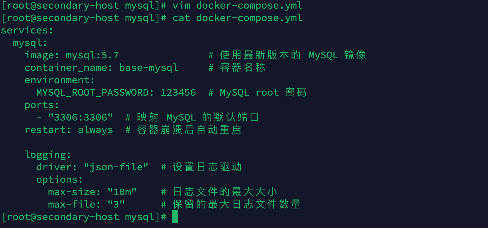
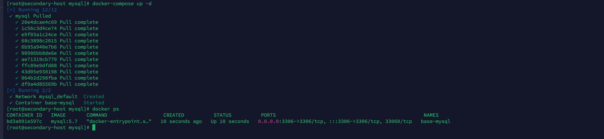
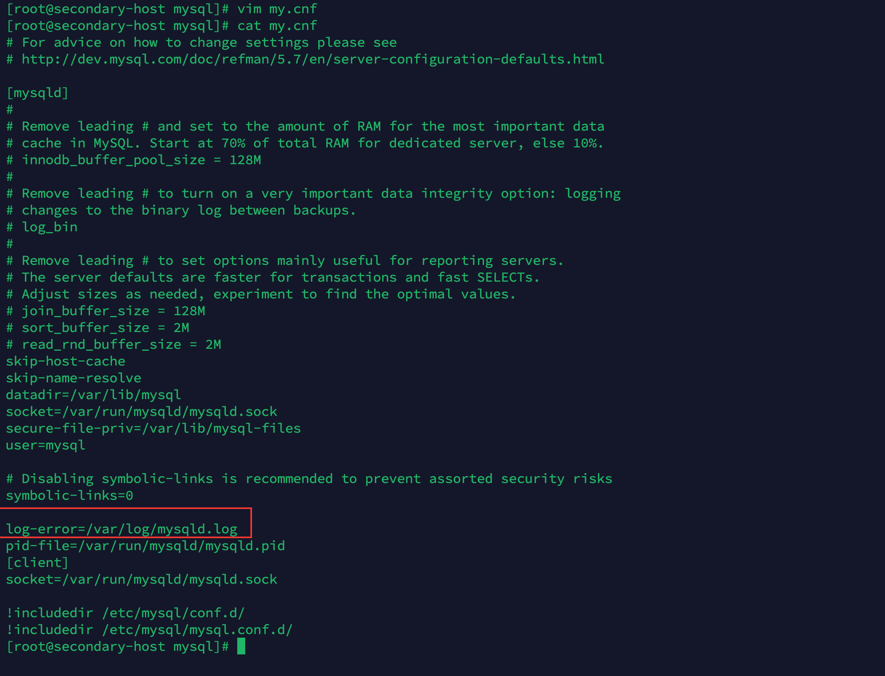
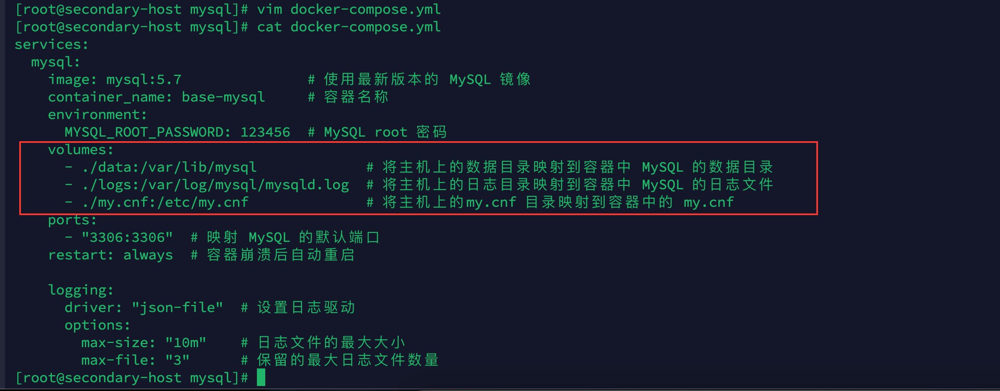
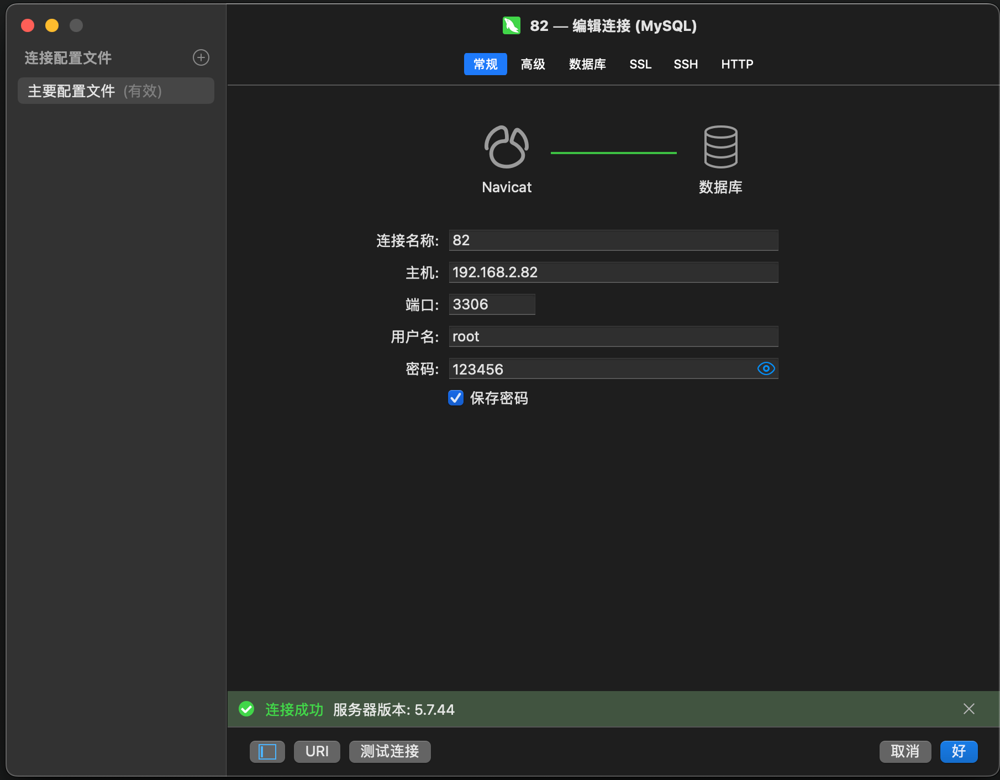
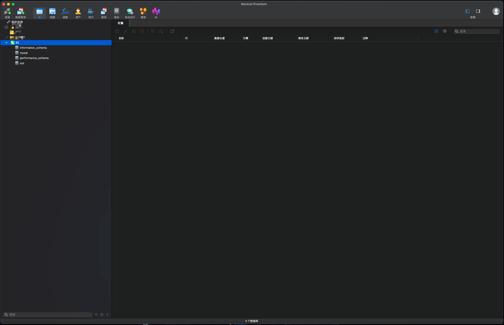

### 前言

> 本次安装使用的是 `Docker`与`docker-compose`，相对于传统的二进制文件安装相比，不需要关心复杂的服务器环境，只需要在服务器上安装 `Docker`即可；使用 `Docker`的时候我们只关注数据的持久化和`Docker容器`与`宿主机`的端口映射即可，其中数据持久化包括 `conf`、`log`、`data`等。

### 基础环境

| 名称             | 版本                           |
| ---------------- | ------------------------------ |
| 服务器及操作系统 | Linux、Centos 7                |
| Docker           | Docker version 26.1.3          |
| Docker Compose   | Docker Compose version v2.27.1 |

### 安装

1. 创建 mysql 文件夹及进入mysql 文件夹

   ```bash
   mkdir /opt/mysql && cd /opt/mysql
   ```
   
   

2. 编写`docker-compose.yml`

   ```bash
   vim docker-compose.yml
   ```

   ```yml
   services:
     mysql:
       image: mysql:5.7               # 使用最新版本的 MySQL 镜像
       container_name: base-mysql     # 容器名称
       environment:
         MYSQL_ROOT_PASSWORD: 123456  # MySQL root 密码
       ports:
         - "3306:3306"  # 映射 MySQL 的默认端口
       restart: always  # 容器崩溃后自动重启
   
       logging:
         driver: "json-file"  # 设置日志驱动
         options:
           max-size: "10m"    # 日志文件的最大大小
           max-file: "3"      # 保留的最大日志文件数量
   ```

   

   临时启动一下将配置文件复制出来

   ```bash
   docker-compose up -d
   ```

   

   ```bash
   docker cp base-mysql:/etc/my.cnf ./
   ```

   

   删除容器

   ```bash
   docker-compose down
   ```

   

3. 修改`mysql.cnf`

   将配置文件`打开并修改`，为日志`指定的输出位置`(这里的位置是容器内的位置)

   ```bash
   vim my.cnf
   ```

   

4. 重新修改`docker-compose.yml`

   ```bash
   vim docker-compose.yml
   ```

   ```yml
   services:
     mysql:
       image: mysql:5.7               # 使用最新版本的 MySQL 镜像
       container_name: base-mysql     # 容器名称
       environment:
         MYSQL_ROOT_PASSWORD: 123456  # MySQL root 密码
       volumes:  
         - ./data:/var/lib/mysql                 # 将主机上的数据目录映射到容器中 MySQL 的数据目录
         - ./logs/mysqld.log:/var/log/mysqld.log # 将主机上的日志目录映射到容器中 MySQL 的日志文件      
         - ./my.cnf:/etc/my.cnf                  # 将主机上的my.cnf 目录映射到容器中的 my.cnf
       ports:
         - "3306:3306"  # 映射 MySQL 的默认端口
       restart: always  # 容器崩溃后自动重启
   
       logging:
         driver: "json-file"  # 设置日志驱动
         options:
           max-size: "10m"    # 日志文件的最大大小
           max-file: "3"      # 保留的最大日志文件数量
   ```

   

5. 创建日志文件

   > `mysqld.log`空文件就可以

   ```bash
   mkdir logs && vim logs/mysqld.log
   ```

   

   赋予`logs`文件夹读写权限

   ```bash
   chmod 777 -R ./logs
   ```

   

6. 启动

   ```bash
   docker-compose up -d
   ```

   

### 测试

   

   
