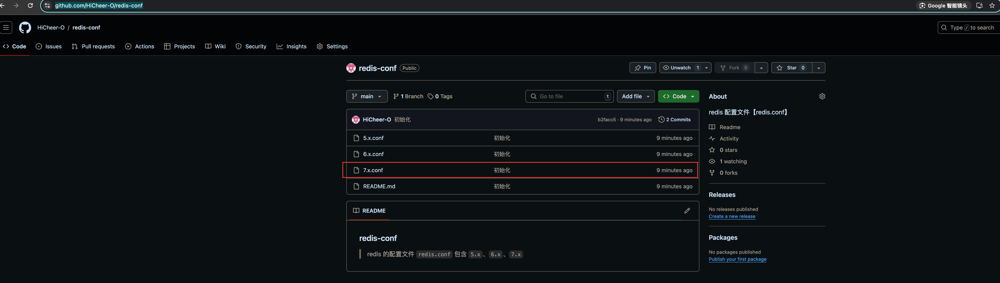
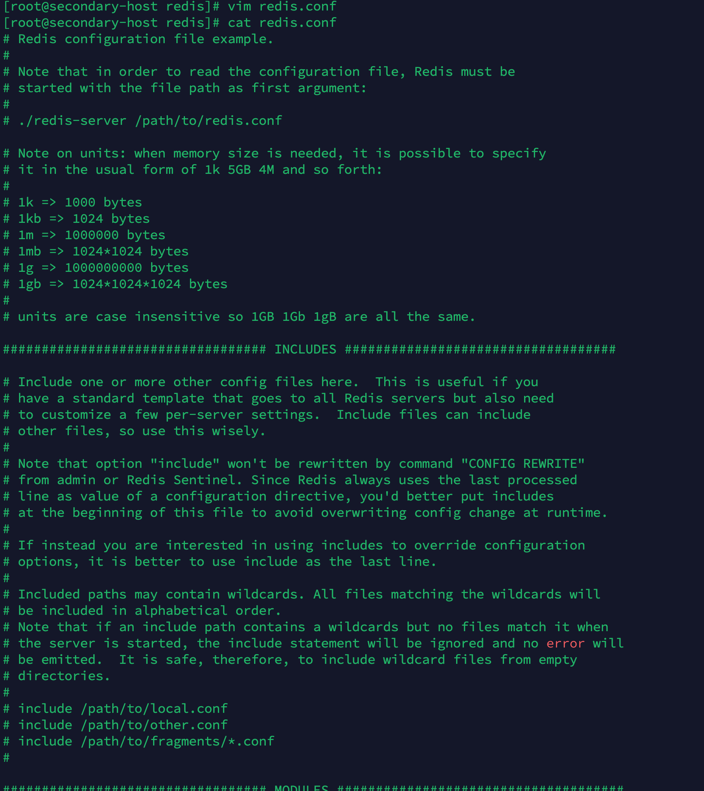
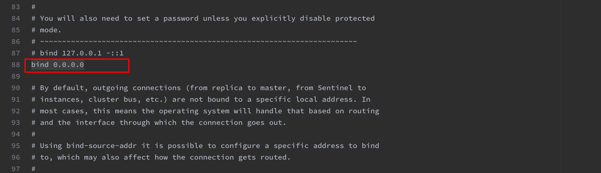
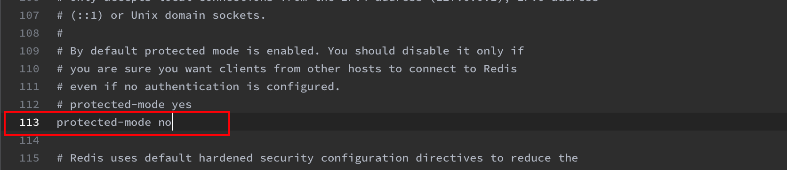
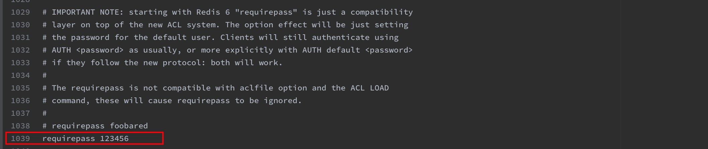
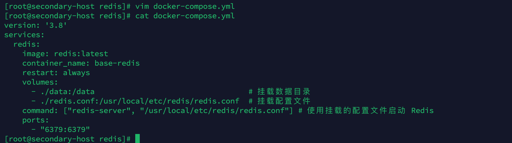
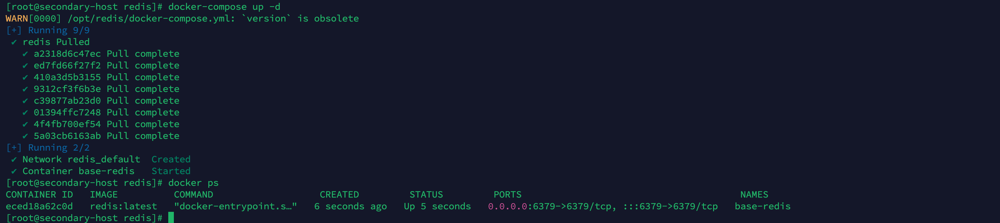
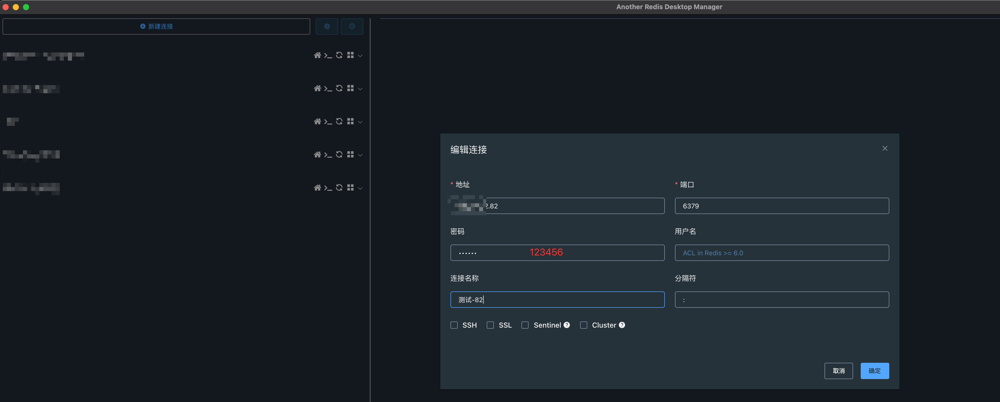
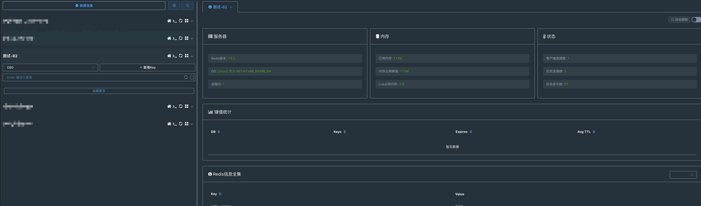

### 前言

> 本次安装使用的是 `Docker`与`docker-compose`，相对于传统的二进制文件安装相比，不需要关心复杂的服务器环境，只需要在服务器上安装 `Docker`即可；使用 `Docker`的时候我们只关注数据的持久化和`Docker容器`与`宿主机`的端口映射即可，其中数据持久化包括 `conf`、`data`等。

### 基础环境

| 名称             | 版本                           |
| ---------------- | ------------------------------ |
| 服务器及操作系统 | Linux、Centos 7                |
| Docker           | Docker version 26.1.3          |
| Docker Compose   | Docker Compose version v2.27.1 |

### 安装

1. 创建 mysql 文件夹及进入mysql 文件夹

   ```bash
   mkdir /opt/redis && cd /opt/redis
   ```

   

2. 创建配置文件`redis.conf`

   > 由于配置文件内容很多，并且容器内也没有配置文件，因此我就放到了我的`github`中；
   >
   > 仓库地址：[redis.conf](https://github.com/HiCheer-O/redis-conf)
   >
   > 包含版本：`5.x`、`6.x`、`7.x`
   >
   > 我因为`redis`下载的是最新版本（7.x），因此用的是`7.x.conf`

   

   ```bash
   vim redis.conf
   ```

   

   > ⚠️注意需要修改`redis.conf`中`三个`位置

   ```conf
   # 允许任何 ip 地址可以访问，默认只允许本机访问，在文件的 87 行左右
   bind 0.0.0.0
   
   # 保护模式，默认 yes，在文件的 112 行左右
   protected-mode no
   
   # 密码，默认 空，在文件的 1037 行左右
   requirepass 123456
   ```

   

   

   

3. 创建`docker-compose.yml`

   ```bash
   vim docker-compose.yml
   ```

   ```yml
   version: '3.8'
   services:
     redis:
       image: redis:latest
       container_name: base-redis
       restart: always
       volumes:
         - ./data:/data                                  # 挂载数据目录
         - ./redis.conf:/usr/local/etc/redis/redis.conf  # 挂载配置文件
       command: ["redis-server", "/usr/local/etc/redis/redis.conf"] # 使用挂载的配置文件启动 Redis
       ports:
         - "6379:6379"
   ```

   

4. 启动

   ```bash
   docker-compose up -d
   ```

   

### 测试





