### 前言
<a href= "https://gitee.com/y_project/RuoYi-Vue">官网前后端分离版本</a>。但是我需要包含接口文档的，这个仓库本身本身有引入 swagger，但是并没有完全实现，只给了实例，因此我将源代码整合了整合 swagger + knife4j ，并且实现了全部接口文档，整合后的代码仓库地址放到文章最后。
<a href= "https://gitee.com/y_project/RuoYi-Vue">官网前后端分离版本（包含接口文档）</a>。<br>
注意一点：<br>

- 数据库相关 sql，自己在创建完数据库后在执行；

  

- 自己根据配置文件修改 mysql 的链接地址和数据库名称，还有 redis 的地址；

  

  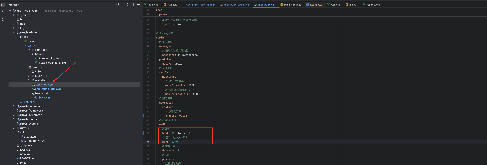
---
### 环境介绍

| 类别           | 详情                             |
| -------------- | -------------------------------- |
| 电脑及系统版本 | MacBook Pro Apple M1 Pro、14.1.2 |
| node 版本      | v18.20.2                         |
| 下载工具       | pnpm                             |
| 框架           | vue3                             |
| 构建工具       | vite                             |
| 组件           | Element-plus                     |
| 开发工具       | WebStorm 2024.1.2                |
| TS的语法       | 没有使用，纯 JS                  |
---
### 开始前建议

- 界面设计参考，若依在线的体验地址<a href='https://vue.ruoyi.vip/login'>相关跳转</a>
- 页面不会写的借助 ChatGPT 来写<a href='https://chatgpt.com/'>相关跳转</a>
- 遇到不会的问题：ChatGPT、百度、Chrome
---
### 项目创建

1. 项目创建

   ```bash
   pnpm create vite
   ```

   

2. 设置项目名称

   ```bash
   ruoyi-ui
   ```

   

3. 框架选择

   ```bash
   vue
   ```

   

4. 数据类型选择

   ```bash
   JavaScript
   ```

   

5. 创建完成

   

---

### 开发工具打开项目

1. 开发工具中打开项目

   

2. 安装相关依赖（注意是项目的根目录下）

   ```bash
   pnpm install
   ```

   

3. 运行项目

   ```bash
   pnpm run dev
   ```

   

4. 点击链接

   

---

### 创建企业开发项目目录

1. 删除项目本身自带的文件

   删除前：

   

   删除后：

   

2. 删除 App.vue 中没有的代码

   删除前：

   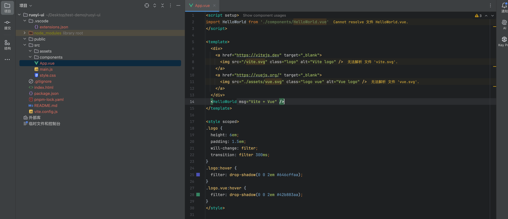

   删除后：

   

3. 创建目录

   ```text
   api --- 后台接口
   assets --- 相关资源（图片等）
   component --- 组件
   layout --- 布局
   plugins --- 插件
   router --- 路由
   views --- 视图（页面）
   ```

   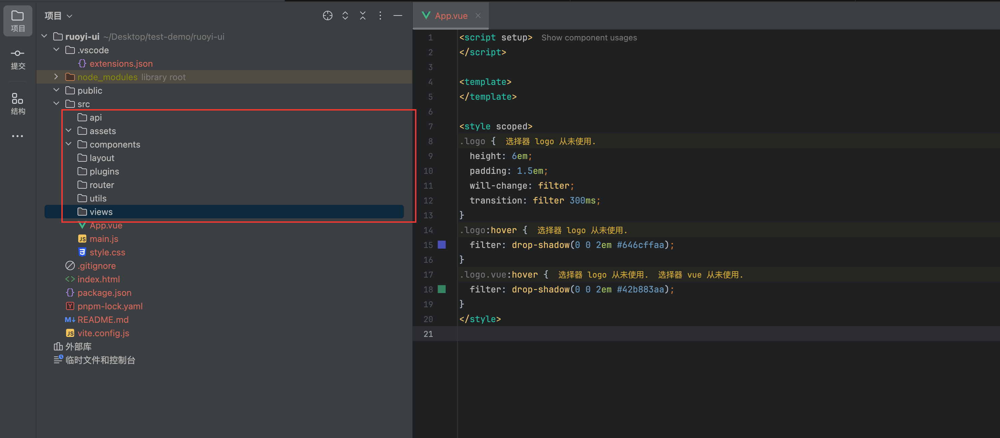
---

### 登录/注册页面

1. 创建登录/注册页面

   

   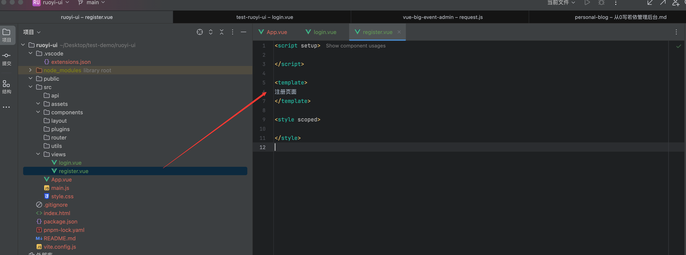

2. 根目录配置

   在开发期间我们为了便于文件之间相互引用，一般是相对路径/绝对路径，再不然是项目根路径，我们一般都只在 src 目录下开发，所以我们配置一个‘@’符号表示 src 在项目中的路径，因此在表示路径的时候只需要‘@/views/login.vue’，就可以指向该文件。下面有具体的引入和使用。

   - 设置“@”

     ```js
     import { fileURLToPath, URL } from 'node:url'
     resolve: {
           // 别名
         alias: {
           // 设置 @ 符号为 ‘src’的根路径
           '@': fileURLToPath(new URL('./src', import.meta.url))
         }
     }
     ```

     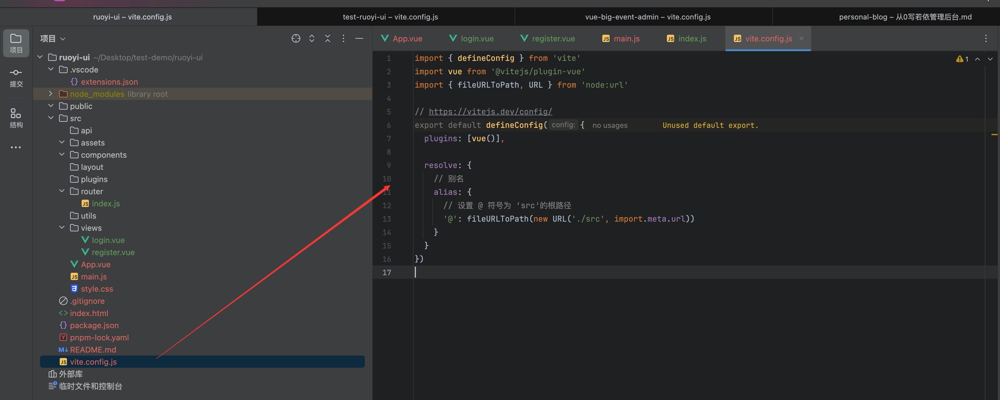

   - 使用方式

     后面的文章中有具体的使用方式，这里不做示例。

3. 配置路由

   - 安装路由插件（<a href='https://router.vuejs.org/zh/installation.html'>官方文档</a>）

     ```bash
     pnpm add vue-router@4
     ```

     

   - 创建路由，并配置登录与注册的路由

     ```js
     import { createWebHashHistory, createRouter } from 'vue-router'
     
     // 路由地址信息
     const routes = [
         { path: "/login", component: () => import('@/views/login.vue') },
         { path: "/register", component: () => import('@/views/register.vue') },
     ]
     
     // 创建路由
     const router = createRouter({
         // 忽略路由器的 URL
         history: createWebHashHistory(),
         // 配置路由信息
         routes,
     })
     
     export default router
     ```

     

   - 将路由注册到项目中

     ```js
     import router from "@/router/index.js";
     
     createApp(App)
         .use(router)
         .mount('#app')
     ```

     

   - 将路由模块的页面引入到主页面中

     ```vue
     <router-view />
     ```

     

   - 测试页面是否配置成功

     

     

     OK，完成。
---
### 引入Element-Ui-plus

1. 官方文档

   <a href='https://element-plus.org/zh-CN/guide/installation.html'>Element-Ui-plus</a>

2. 安装

   ```bash
   pnpm install element-plus
   ```

   

3. 导入（我选择按需导入，也是官方推荐）

   - 这里用到了官方插件，实现按需导入

     ```bash
     pnpm install -D unplugin-vue-components unplugin-auto-import
     ```

     

   - 配置插件

     ```js
     import AutoImport from 'unplugin-auto-import/vite'
     import Components from 'unplugin-vue-components/vite'
     import { ElementPlusResolver } from 'unplugin-vue-components/resolvers'
     
     AutoImport({
         resolvers: [ElementPlusResolver()],
     }),
     Components({
         resolvers: [ElementPlusResolver()],
     })
     ```

     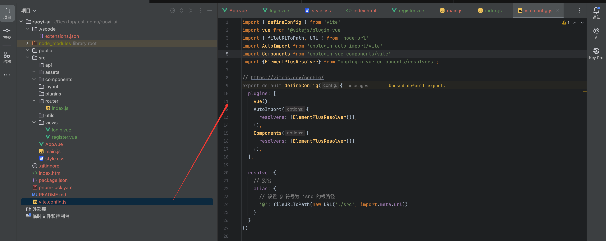
---
### 优化登录注册页面

注意：如果页面不会写，建议使用 ChatGPT 帮你生成一些基础的页面，再配合 Element-plus 官方文档进行调整，因为我就是这样开发的。

1. 美化登录页面

   - 基础美化

     ```vue
     <script setup>
     import { ref } from 'vue';
     import 'element-plus/theme-chalk/index.css';
     
     // 初始化表单
     const userForm = ref({
       username: '',
       password: '',
       captcha: '',
     });
     
     // 收集表单参数
     const form = ref()
     
     // 表单规则检验
     const userFormRules = {
       username: [
         { required: true, message: '请输入您的账号', trigger: 'blur' },
       ],
       password: [
         { required: true, message: '请输入您的密码', trigger: 'blur' },
       ],
       captcha: [
         { required: true, message: '请输入验证码', trigger: 'blur' },
       ]
     }
     
     const captchaUrl = ref('');
     
     const refreshCaptcha = () => {
       // 这里可以添加刷新验证码的逻辑
       captchaUrl.value = '';
     };
     
     // 登录提交
     const onSubmit = async () => {
     };
     
     </script>
     
     <template>
       <div class="login-container">
         <el-form
             :model="userForm"
             :rules="userFormRules"
             ref="form"
             label-width="0px">
           <h3 class="title" style="color: #707070">若依后台管理系统</h3>
           <el-form-item prop="username">
             <el-input
                 v-model="userForm.username"
                 placeholder="账号"
             >
             </el-input>
           </el-form-item>
           <el-form-item prop="password">
             <el-input
                 v-model="userForm.password"
                 type="password"
                 placeholder="密码"
             >
             </el-input>
           </el-form-item>
           <el-form-item prop="captcha">
             <el-row :gutter="20">
               <el-col :span="14">
                 <el-input
                     v-model="userForm.captcha"
                     placeholder="验证码"
                 >
                 </el-input>
               </el-col>
               <el-col :span="10">
                 
               </el-col>
             </el-row>
           </el-form-item>
           <el-form-item>
             <el-button type="primary" @click="onSubmit" style="width: 100%;">登录</el-button>
           </el-form-item>
         </el-form>
       </div>
     </template>
     
     <style scoped>
     .login-container {
       max-width: 400px;
       margin: auto;
       padding: 20px;
       background: white;
       border-radius: 8px;
       box-shadow: 0 2px 12px rgba(0, 0, 0, 0.1);
     }
     .captcha-img {
       cursor: pointer;
       border: 1px solid #dcdfe6;
       height: 40px;
     }
     </style>
     ```

     

     页面展示

     

   - 进阶（在 input 输入框上加图标）

     安装 element-icon 库<a href='https://element-plus.org/zh-CN/component/icon.html'>官方文档</a>

     ```bash
     pnpm install @element-plus/icons-vue
     ```

     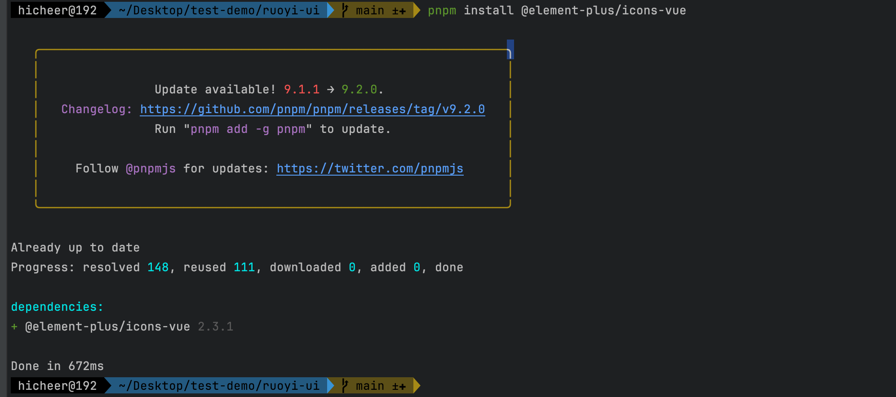

     根据官方文档说明插入

     <a href='https://element-plus.org/zh-CN/component/input.html'>input 官方文档</a>

     

     我的代码

     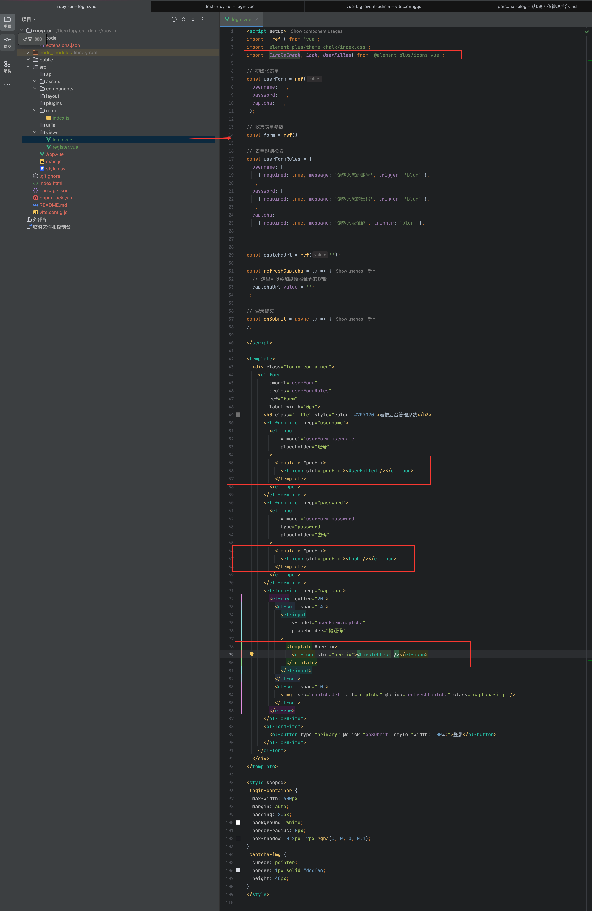

     

2. 美化注册页面（这里就不贴代码了）

   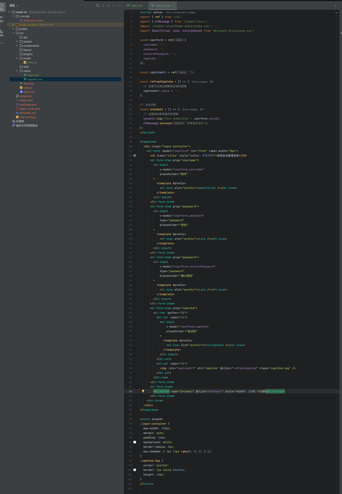

   

3. 登录页面与注册页面相互跳转

   - 登录页面跳转注册页

     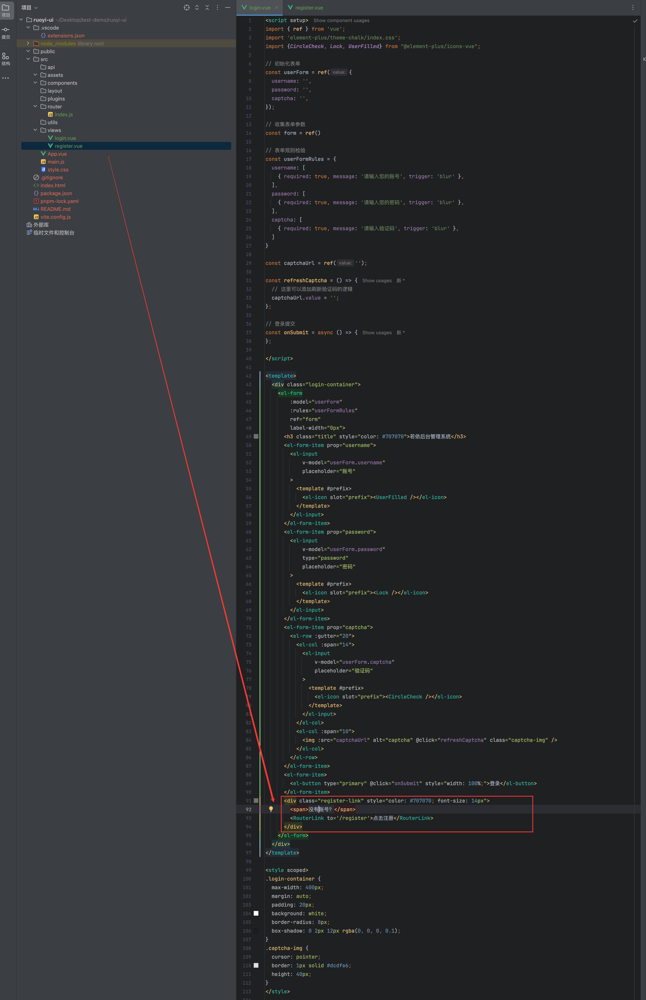

     

   - 注册页面跳转登录页面

     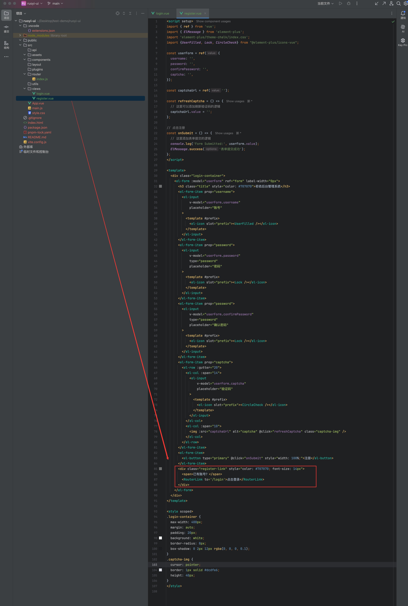

     
---
### 配置统一发送请求对象
1. 安装axios

   <a href='https://axios-http.com/zh/docs/intro'>官网地址</a>

   ```
   pnpm install axios
   ```

   

2. 创建`request.js`类

   添加添加公共方法、设置请求基地址（baseURL）,设置拦截器

   ```js
   import axios from 'axios'
   
   // 请求地址
   const baseURL = 'http://localhost:8080'
   // 公共请求方法
   const instance = axios.create({
   	baseURL,
   	timeout: 5000,
   })
   
   // 添加请求拦截器
   axios.interceptors.request.use(function (config) {
   	// 在发送请求之前做些什么
   	return config;
   }, function (error) {
   	// 对请求错误做些什么
   	return Promise.reject(error);
   });
   
   // 添加响应拦截器
   axios.interceptors.response.use(function (response) {
   	// 2xx 范围内的状态码都会触发该函数。
   	// 对响应数据做点什么
   	return response;
   }, function (error) {
   	// 超出 2xx 范围的状态码都会触发该函数。
   	// 对响应错误做点什么
   	return Promise.reject(error);
   });
   
   ```

   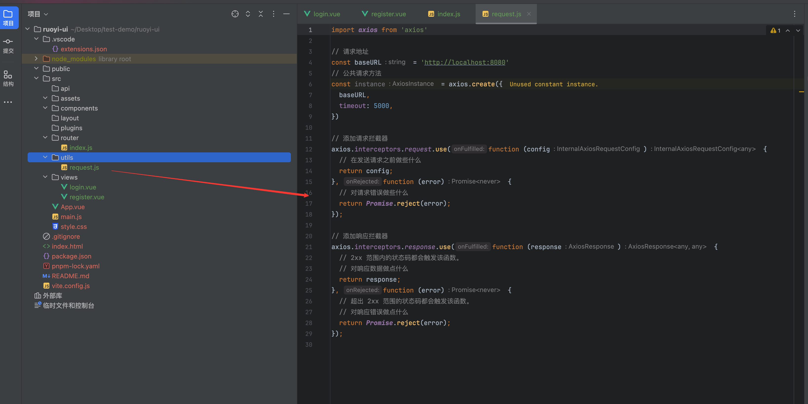

   这些在官网都有介绍，直接拷贝使用，具体的拦截器逻辑自己根据业务实现。

---

### 获取验证码

1. 首先是要在本地将`ruoyi`项目启动起来的


接口文档地址

```http
http://localhost:8080/doc.html#/home
```

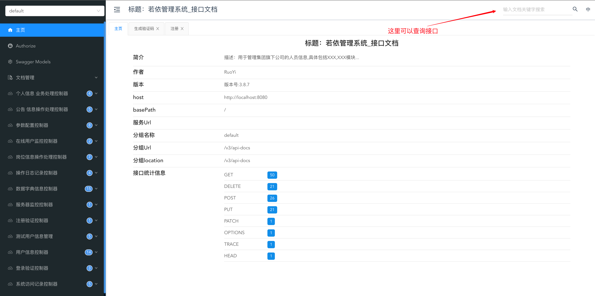

例如：验证码，


接口地址的前缀

```http
http://localhost:8080
```

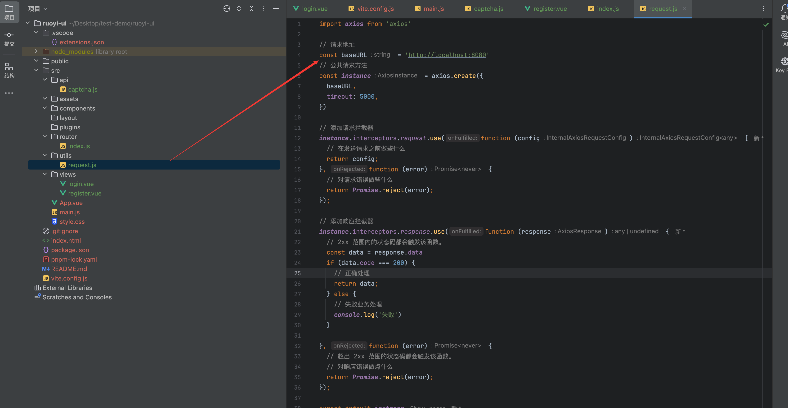

接口的名称

```http
/captchaImage
```

2. 创建关于获取验证码 API 的 JS 页面

   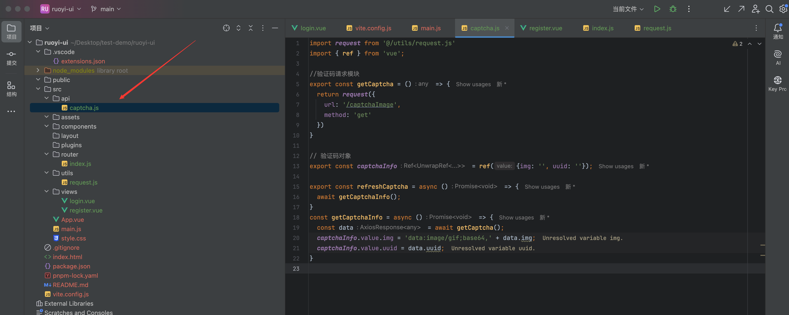

   相关代码（注意：代码上面的注释，对每个部分做了解释）

   ```js
   import request from '@/utils/request.js'
   import { ref } from 'vue';
   
   // 验证码请求模块
   export const getCaptcha = () => {
   	return request({
       // 接口地址
   		url: '/captchaImage',
       // 请求类型
   		method: 'get'
   	})
   }
   
   // 初始化验证码对象，我们只需要验证码中的两个参数即可，其他参数不需要
   export const captchaInfo = ref({img: '', uuid: ''});
   
   // 点击验证码图片，重新获取验证码；这里对应登录/注册页面中验证码点击事件
   export const refreshCaptcha = async () => {
   	await getCaptchaInfo();
   }
   
   // 解析验证码请求返回后响应参数，然后给验证码对象赋值
   const getCaptchaInfo = async () => {
   	const data = await getCaptcha();
     // base64图片拼接，加上前缀 'data:image/gif;base64,'，图片才可以被浏览器解析
   	captchaInfo.value.img = 'data:image/gif;base64,' + data.img;
   	captchaInfo.value.uuid = data.uuid;
   }
   
   ```

   为什么将这一块全部写在这里：因为这些方法在登录页面和注册页面都是用到，卸载同一个地方，方便维护。

3. 登录页面 `login.vue`

   

   引入 captchaInfo对象、refreshCaptcha方法

   ```js
   import {captchaInfo, refreshCaptcha} from "@/api/captcha.js";
   ```

   一进页面就加载

   ```js
   onMounted(() => {
     // 第一次进入页面验证码刷新
     refreshCaptcha();
   });
   ```

   验证码相关的代码

   ```vue
   <el-col :span="10">
   	
   </el-col>
   ```

4. 最后注意一下，`request.js` 我这里做了简单的调整

   

   我们前面说过根据自己的接口响应参数结构做出一些调整。

   ```js
   import axios from 'axios'
   
   // 请求地址
   const baseURL = 'http://localhost:8080'
   // 公共请求方法
   const instance = axios.create({
   	baseURL,
   	timeout: 5000,
   })
   
   // 添加请求拦截器
   instance.interceptors.request.use(function (config) {
   	// 在发送请求之前做些什么
   	return config;
   }, function (error) {
   	// 对请求错误做些什么
   	return Promise.reject(error);
   });
   
   // 添加响应拦截器
   instance.interceptors.response.use(function (response) {
   	// 2xx 范围内的状态码都会触发该函数。
   	const data = response.data
   	if (data.code === 200) {
   		// 正确处理
   		return data;
   	} else {
   		// 失败业务处理
   		console.log('失败')
   	}
   
   }, function (error) {
   	// 超出 2xx 范围的状态码都会触发该函数。
   	// 对响应错误做点什么
   	return Promise.reject(error);
   });
   
   export default instance
   ```

5. 效果

   

   <span style="color: yellow;">注意一下，因为我是先自己做，后整理的文档，有些文档衔接的不是很好，比如现在这里的页面背景色是黑色，后面就就会变成其他背景色；这就是因为我先自己做后面再整理文档，有些没有处理好文章的上下文，但是没关系，你看到诸如此类的问题后面的文章的流程中会补回来的，别担心，感谢包容！</span>

6. 注册页面`register.vue`相同（自己从上面复制相关代码）

   

### 登录接口

1. 分析接口文档

   

   请求参数

   ```json
   {
     "code": "",  // 验证码（这个是获取验证码图片后，根据图片计算出来的）
     "password": "", // 密码（默认：admin123）
     "username": "", // 账户（默认：admin）
     "uuid": "" // uuid（之前在获取的验证码的时候，返回来的参数）
   }
   ```

2. 分析相应结构

   首先，调用一下接口

   ```json
   {
     "code": "",  // 自己调用获取验证码接口自己填写
     "password": "admin123", // 密码（默认：admin123）
     "username": "admin", // 账户（默认：admin）
     "uuid": "" // 自己调用获取验证码接口自己填写
   }
   ```

   注意：`uuid`与`code`他们呢是一组对应的，而且用完后后台会将 uuid 从 redis 中清除，为了方便调试我们可以直接不做跳过验证码校验。

   

   注释掉，重新启动，就不会做验证码校验。

2. 然后分析一下返回结果

   

   只需要成功，拿到 token 就可以。

3. 想一些问题

    - token 存哪里，如何做持久化

      我们一般是将 token 存入到浏览器的 `Local storage`中的，当然也有放到浏览器的`Cookies`中的，我们这里将他放到 `Local storage`

      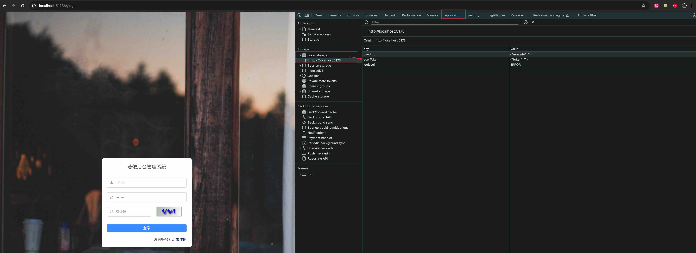

    - 后面我们所有请求都是需要 token

      先给思路，我们只需要放到请求前置拦截器中，token 就从 `Local storage`中取就可以了，后面有具体实现步骤

4. 先发送请求，获取到 token

   创建`user.js`

   

   ```js
   // 用户相关的，登录、登出、注册、获取用户信息、修改用户信息
   import request from '@/utils/request.js'
   
   // 登录
   //请求参数 obj示例：{"code":"","password":"","username":"","uuid":""}
   export const login = (obj) => {
   	return request({
   		url: '/login',
   		method: "post",
   		data: obj
   	})
   }
   
   ```

   绑定到`login.vue`页面的`登录`按钮上

   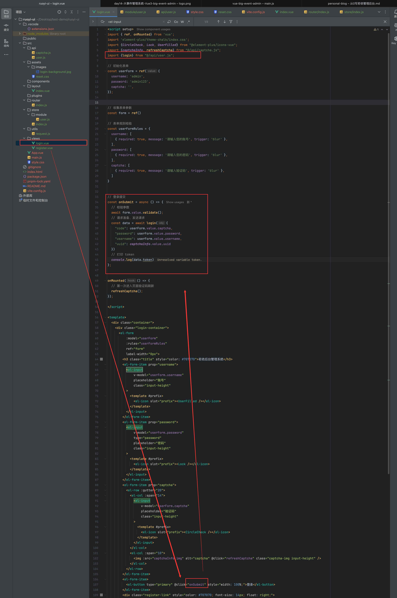

   ```js
   import {login} from "@/api/user.js";
   
   // 登录提交
   const onSubmit = async () => {
     // 校验参数
     await form.value.validate();
     // 请求准备、发送请求
     const data = await login({
       "code": userForm.value.captcha,
       "password": userForm.value.password,
       "username": userForm.value.username,
       "uuid": captchaInfo.value.uuid
     })
     // 打印 token
     console.log(data.token)
   };
   ```

5. `token`持久化

   我这里使用的 vue 配套的 `pinia`，`pinia`（pinia 官方文档）默认是默认保存到内存中的，也就是刷新页面，就会被清除；可以通过配置持久化到 `Local storage`。

    - 安装

      

      

      ```bash
      pnpm install pinia
      pnpm install pinia-plugin-persistedstate
      ```

    - 引入（这里和上面有点区别，因为考虑到后续为了方便引入更多的插件）

      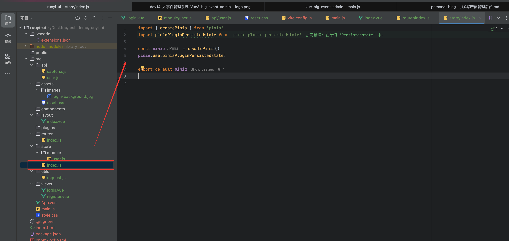

      ```js
      import { createPinia } from 'pinia'
      import piniaPluginPersistedstate from 'pinia-plugin-persistedstate'
      
      const pinia = createPinia()
      pinia.use(piniaPluginPersistedstate)
      
      export default pinia
      
      ```

      

      ```js
      import { createApp } from 'vue'
      import "./style.css"
      import 'element-plus/dist/index.css'
      
      import App from './App.vue'
      import router from "@/router/index.js";
      import pinia from "@/store/index.js";
      
      const app = createApp(App);
      
      // 添加路由 router
      app.use(router)
      
      // 添加 pinia
      app.use(pinia)
      
      // 挂载
      app.mount('#app')
      
      ```

- 创建`store`

  什么是`store`，根据官方文档上看，其实就是一个`实体对象`，里面定义唯一的标识`id`，类中的`参数`，操作参数的方法等

  首先创建文件`user.js`（根据自己模块块起这个文件名）

  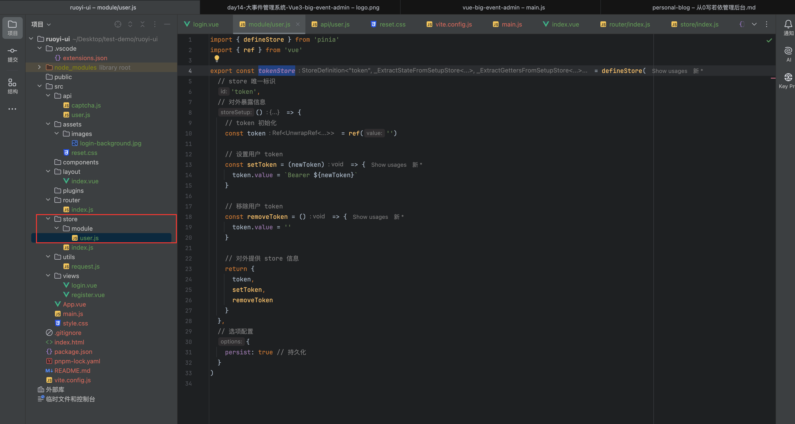

  ```js
     import { defineStore } from 'pinia'
     import { ref } from 'vue'
     
     export const tokenStore = defineStore(
       // store 唯一标识
       'token',
       // 对外暴露信息
       () => {
         // token 初始化
         const token = ref('')
         
         // 设置用户 token
         const setToken = (newToken) => {
           token.value = `Bearer ${newToken}`
         }
         
         // 移除用户 token
         const removeToken = () => {
           token.value = ''
         }
         
         // 对外提供 store 信息
         return {
           token,
           setToken,
           removeToken
         }
       },
       // 选项配置
       {
         persist: true // 持久化
       }
     )
  ```

  最后在`index.js`中统一导出

  

  ```js
     // store 统一管理模块下
     export * from './module/user'
  ```

- 将我们获取的`token`持久化

  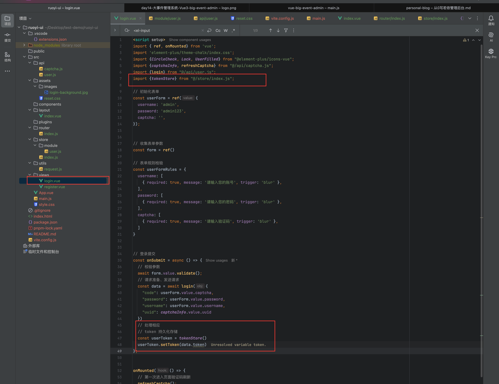

  ```js
     import {tokenStore} from "@/store/index.js";
     
     // token 持久化存储
     const userToken = tokenStore()
     userToken.setToken(data.token)
  ```

- 测试一下是否存入到了 `Local storage`

  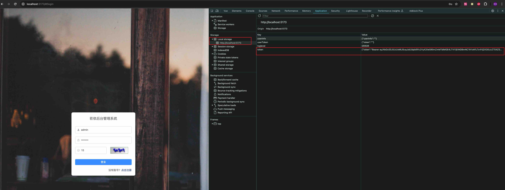

  OK 了

6. 在请求拦截器中统一在请求头中添加`token`

   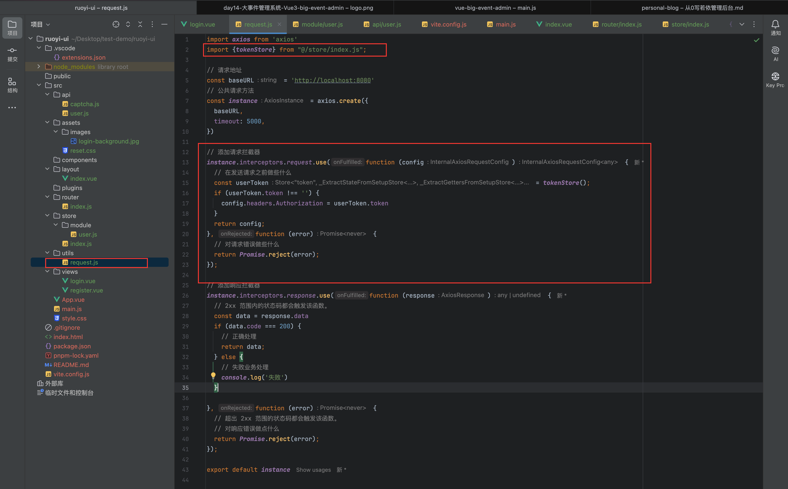

   ```js
      import {tokenStore} from "@/store/index.js";
      
      instance.interceptors.request.use(function (config) {
      	// 在发送请求之前做些什么
      	const userToken = tokenStore();
      	if (userToken.token !== '') {
      		config.headers.Authorization = userToken.token
      	}
      	return config;
      }, function (error) {
      	// 对请求错误做些什么
      	return Promise.reject(error);
      });
   ```

   测试一下是否请求中携带了`token`

   因为我们还没有接其他接口，我们可以点击刷新验证码，看看是否添加成功了。

   

   OK 了

7. 说明一下

   到这里基本的 vue 内容就就完成了，剩下应该是：

    - 封装通用组件（包括组件值传递）
        - 画页面（这样也是我的薄弱项）

   废话不多说，开始画页面；后面需要用到封装组件的，后面再说

