### 用户管理页面

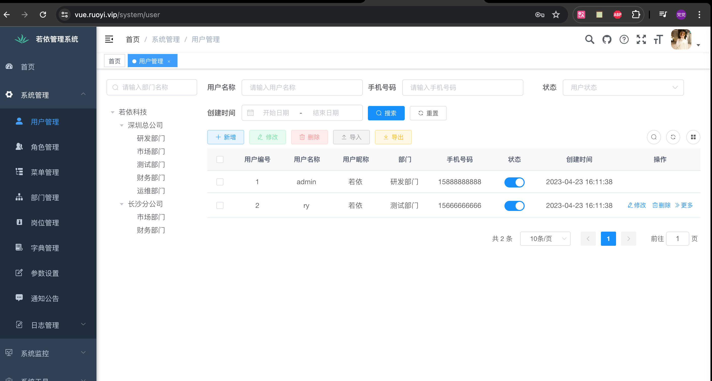

> 我会做那些内容？
>
> 1. 左边区域部门列表树，上面的搜索框可以做查询
> 2. 右边，上面的筛选框，包括`用户名称`、`手机号码`、`状态`、`创建时间`
> 3. `增删改查导出`按钮不做，但是哪一行中最后边的`隐藏/展示列表列`按钮会做
> 4. 简单的列表会做

最终的简易效果

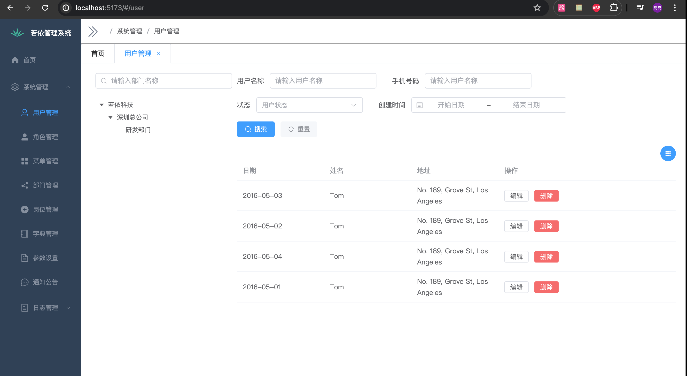

1. 左右布局

   使用 <a href='https://element-plus.org/zh-CN/component/layout.html'>element-ui-布局</a>

   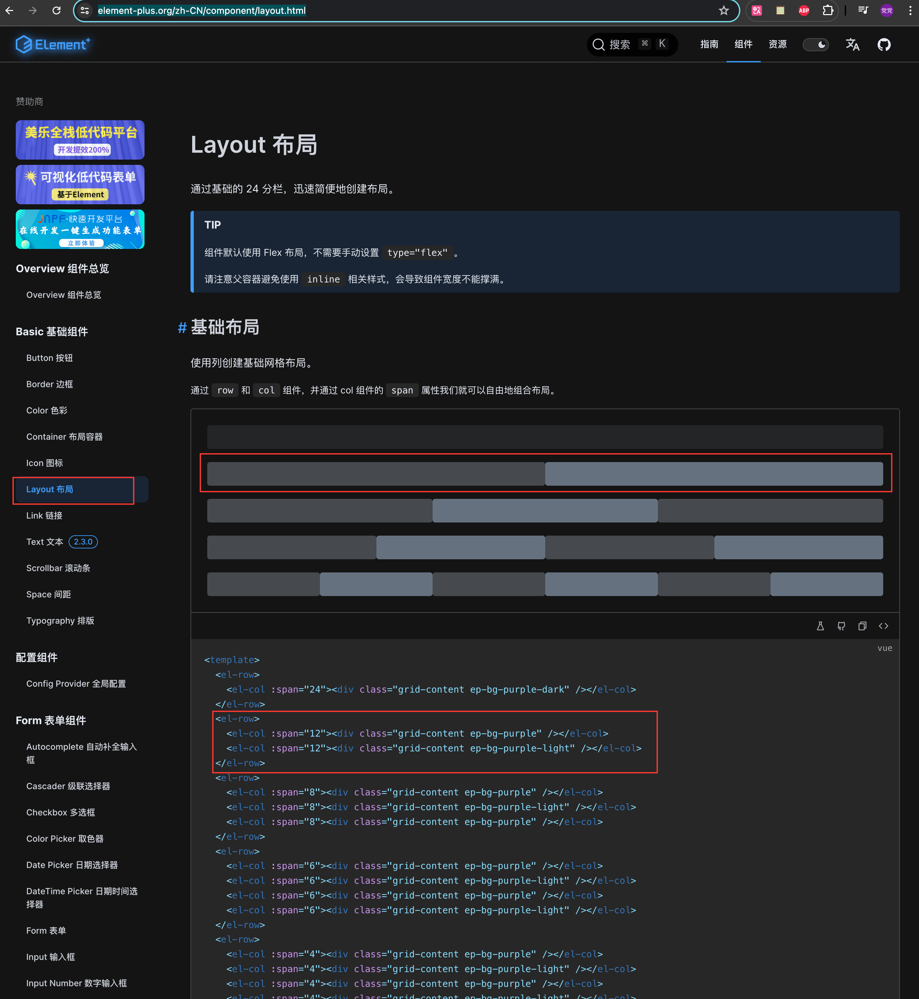

   调整一下左右的宽度，通过`:span`参数，注意`element-ui`的布局将一行拆成了24分，自己写的时候注意一下

   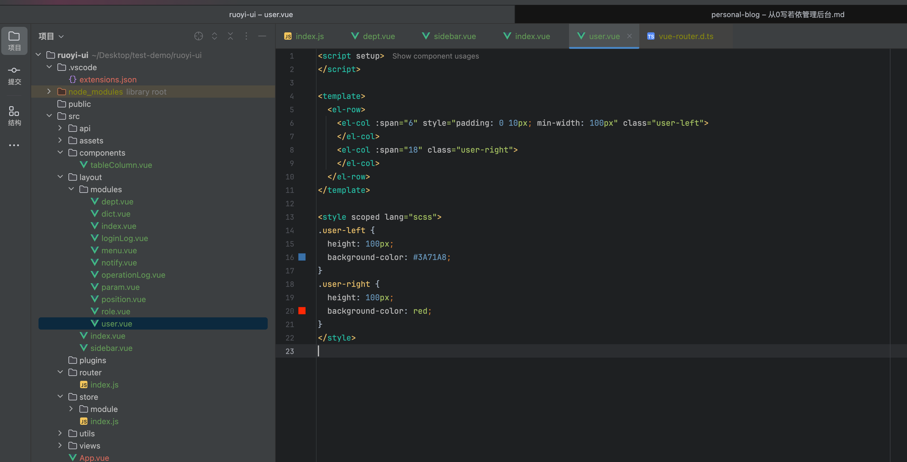

   ```vue
   <script setup>
   </script>
   
   <template>
     <el-row>
       <el-col :span="6" style="padding: 0 10px; min-width: 100px" class="user-left">
       </el-col>
       <el-col :span="18" class="user-right">
       </el-col>
     </el-row>
   </template>
   
   <style scoped lang="scss">
   .user-left {
     height: 100px;
     background-color: #3A71A8;
   }
   .user-right {
     height: 100px;
     background-color: red;
   }
   </style>
   ```

   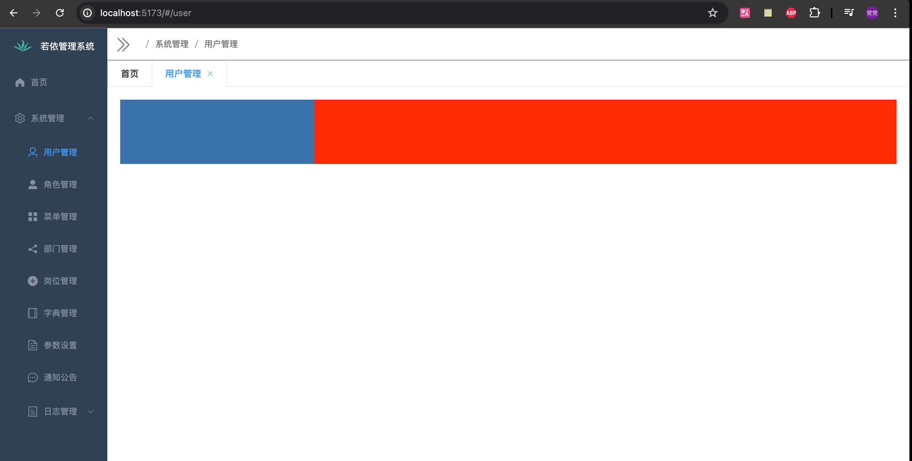

2. 左边部门

   效果

   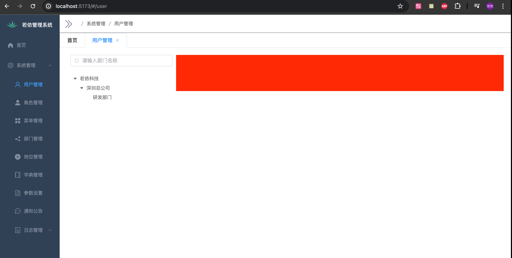

   ```vue
   <script setup>
   import {  Search, } from '@element-plus/icons-vue'
   import { ref, watch, reactive } from 'vue'
   import { ElTree } from 'element-plus'
   
   const filterText = ref('')
   const treeRef = ref()
   
   const defaultProps = {
     children: 'children',
     label: 'label',
   }
   
   watch(filterText, (val) => {
     treeRef.value.filter(val)
   })
   
   const filterNode = (value, data) => {
     if (!value) return true
     return data.label.includes(value)
   }
   
   const dept_data = [
     {
       label: '若依科技',
       children: [
         {
           label: '深圳总公司',
           children: [
             {
               label: '研发部门',
             },
           ],
         },
       ],
     }
   ]
   
   </script>
   
   <template>
     <el-row>
       <el-col :span="6" style="padding: 0 10px; min-width: 100px">
         <el-input
             v-model="filterText"
             style="width: 100%; margin-bottom: 20px;"
             placeholder="请输入部门名称"
         >
           <template #prefix>
             <el-icon class="el-input__icon"><search /></el-icon>
           </template>
         </el-input>
         <el-tree
             ref="treeRef"
             style="max-width: 600px;"
             class="filter-tree"
             :data="dept_data"
             :props="defaultProps"
             default-expand-all
             :filter-node-method="filterNode"
             empty-text="暂无数据"
         />
       </el-col>
     </el-row>
   </template>
   
   <style scoped lang="scss">
   
   .user-right {
     height: 100px;
     background-color: red;
   }
   </style>
   
   ```

3. 右边筛选

   效果

   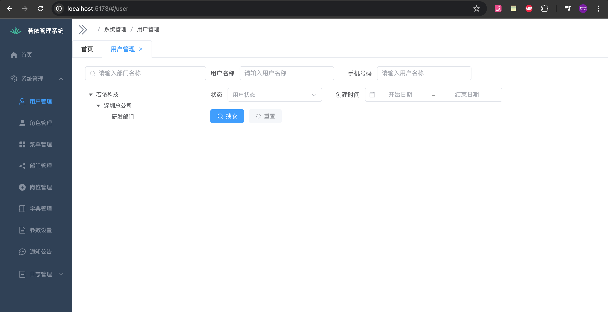

   ```vue
   <script setup>
   import { Refresh, Search, } from '@element-plus/icons-vue'
   import { ref, watch, reactive } from 'vue'
   import { ElTree } from 'element-plus'
   
   const filterText = ref('')
   const treeRef = ref()
   
   const defaultProps = {
     children: 'children',
     label: 'label',
   }
   
   watch(filterText, (val) => {
     treeRef.value.filter(val)
   })
   
   const filterNode = (value, data) => {
     if (!value) return true
     return data.label.includes(value)
   }
   
   const dept_data = [
     {
       label: '若依科技',
       children: [
         {
           label: '深圳总公司',
           children: [
             {
               label: '研发部门',
             },
           ],
         },
       ],
     }
   ]
   
   // 右边
   
   const formInline = reactive({
     user: '',
     region: '',
     date: '',
   })
   
   const onSubmit = () => {
     console.log('submit!')
   }
   
   const refresh = () => {
     console.log('refresh!')
   }
   </script>
   
   <template>
     <el-row>
       <el-col :span="6" style="padding: 0 10px; min-width: 100px">
         <el-input
             v-model="filterText"
             style="width: 100%; margin-bottom: 20px;"
             placeholder="请输入部门名称"
         >
           <template #prefix>
             <el-icon class="el-input__icon"><search /></el-icon>
           </template>
         </el-input>
         <el-tree
             ref="treeRef"
             style="max-width: 600px;"
             class="filter-tree"
             :data="dept_data"
             :props="defaultProps"
             default-expand-all
             :filter-node-method="filterNode"
             empty-text="暂无数据"
         />
       </el-col>
       <el-col :span="18" class="user-right">
         <div>
           <el-form :inline="true" :model="formInline" class="demo-form-inline">
             <el-form-item label="用户名称">
               <el-input v-model="formInline.user" placeholder="请输入用户名称" clearable />
             </el-form-item>
             <el-form-item label="手机号码">
               <el-input v-model="formInline.user" placeholder="请输入用户名称" clearable />
             </el-form-item>
             <el-form-item label="状态">
               <el-select v-model="formInline.region" placeholder="用户状态" clearable>
                 <el-option label="正常" value="0" />
                 <el-option label="停用" value="1" />
               </el-select>
             </el-form-item>
             <el-form-item label="创建时间">
               <el-date-picker
                   v-model="formInline.date"
                   type="monthrange"
                   clearable
                   range-separator="-"
                   start-placeholder="开始日期"
                   end-placeholder="结束日期"
               />
             </el-form-item>
             <el-form-item>
               <el-button type="primary" @click="onSubmit" :icon="Search">搜索</el-button>
               <el-button type="info" @click="refresh" :icon="Refresh" text bg>重置</el-button>
             </el-form-item>
           </el-form>
         </div>
       </el-col>
     </el-row>
   </template>
   
   <style scoped lang="scss">
   .el-row {
     margin-bottom: 20px;
   }
   .el-row:last-child {
     margin-bottom: 0;
   }
   .el-col {
     border-radius: 4px;
   }
   
   .grid-content {
     border-radius: 4px;
     min-height: 36px;
   }
   
   .demo-form-inline .el-input {
     --el-input-width: 220px;
   }
   
   .demo-form-inline .el-select {
     --el-select-width: 220px;
   }
   
   el-button {
     border: 1px solid black;
   }
   
   .table-container {
     position: relative;
   }
   </style>
   
   ```

4. 表单数据

   效果（这里只是单纯的数据展示，操作按钮是没有效果的）

   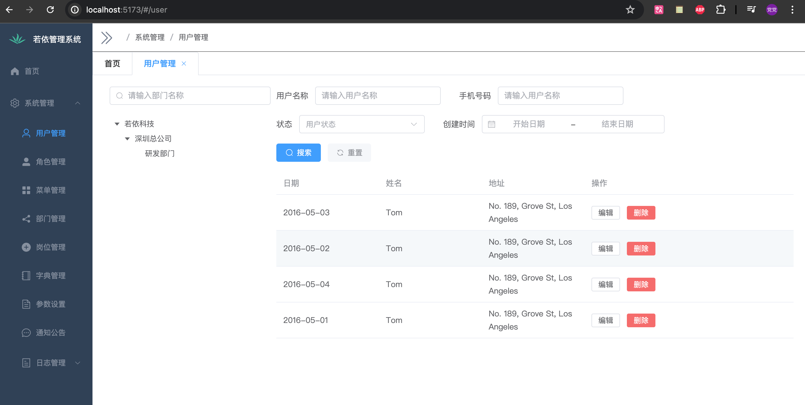

   ```vue
   <script setup>
   import { Refresh, Search, Setting } from '@element-plus/icons-vue'
   import { ref, watch, reactive } from 'vue'
   import { ElTree } from 'element-plus'
   
   const filterText = ref('')
   const treeRef = ref()
   
   const defaultProps = {
     children: 'children',
     label: 'label',
   }
   
   watch(filterText, (val) => {
     treeRef.value.filter(val)
   })
   
   const filterNode = (value, data) => {
     if (!value) return true
     return data.label.includes(value)
   }
   
   const dept_data = [
     {
       label: '若依科技',
       children: [
         {
           label: '深圳总公司',
           children: [
             {
               label: '研发部门',
             },
           ],
         },
       ],
     }
   ]
   
   // 右边
   
   const formInline = reactive({
     user: '',
     region: '',
     date: '',
   })
   
   const onSubmit = () => {
     console.log('submit!')
     console.log(columns)
   }
   
   const refresh = () => {
     console.log('refresh!')
   }
   
   const tableData = [
     {
       date: '2016-05-03',
       name: 'Tom',
       address: 'No. 189, Grove St, Los Angeles',
       sex: '男'
     },
     {
       date: '2016-05-02',
       name: 'Tom',
       address: 'No. 189, Grove St, Los Angeles',
       sex: '男'
     },
     {
       date: '2016-05-04',
       name: 'Tom',
       address: 'No. 189, Grove St, Los Angeles',
       sex: '男'
     },
     {
       date: '2016-05-01',
       name: 'Tom',
       address: 'No. 189, Grove St, Los Angeles',
       sex: '男'
     },
   ]
   
   const columns = reactive([
     { label: '日期', prop: 'date' },
     { label: '姓名', prop: 'name' },
     { label: '地址', prop: 'address' },
   ])
   
   
   </script>
   
   <template>
     <el-row>
       <el-col :span="6" style="padding: 0 10px; min-width: 100px">
         <el-input
             v-model="filterText"
             style="width: 100%; margin-bottom: 20px;"
             placeholder="请输入部门名称"
         >
           <template #prefix>
             <el-icon class="el-input__icon"><search /></el-icon>
           </template>
         </el-input>
         <el-tree
             ref="treeRef"
             style="max-width: 600px;"
             class="filter-tree"
             :data="dept_data"
             :props="defaultProps"
             default-expand-all
             :filter-node-method="filterNode"
             empty-text="暂无数据"
         />
       </el-col>
       <el-col :span="18" class="user-right">
         <div>
           <el-form :inline="true" :model="formInline" class="demo-form-inline">
             <el-form-item label="用户名称">
               <el-input v-model="formInline.user" placeholder="请输入用户名称" clearable />
             </el-form-item>
             <el-form-item label="手机号码">
               <el-input v-model="formInline.user" placeholder="请输入用户名称" clearable />
             </el-form-item>
             <el-form-item label="状态">
               <el-select v-model="formInline.region" placeholder="用户状态" clearable>
                 <el-option label="正常" value="0" />
                 <el-option label="停用" value="1" />
               </el-select>
             </el-form-item>
             <el-form-item label="创建时间">
               <el-date-picker
                   v-model="formInline.date"
                   type="monthrange"
                   clearable
                   range-separator="-"
                   start-placeholder="开始日期"
                   end-placeholder="结束日期"
               />
             </el-form-item>
             <el-form-item>
               <el-button type="primary" @click="onSubmit" :icon="Search">搜索</el-button>
               <el-button type="info" @click="refresh" :icon="Refresh" text bg>重置</el-button>
             </el-form-item>
           </el-form>
         </div>
         <div class="table-container">
           <el-table :data="tableData" style="width: 100%">
             <el-table-column
                 v-for="(item, index) in columns"
                 :key="index"
                 :prop="item.prop"
                 :label="item.label"
                 width="180"
             />
             <el-table-column label="操作">
               <el-button size="small" @click="">编辑</el-button>
               <el-button size="small" type="danger" @click="">删除</el-button>
             </el-table-column>
           </el-table>
         </div>
       </el-col>
     </el-row>
   </template>
   
   <style scoped lang="scss">
   .el-row {
     margin-bottom: 20px;
   }
   .el-row:last-child {
     margin-bottom: 0;
   }
   .el-col {
     border-radius: 4px;
   }
   
   .grid-content {
     border-radius: 4px;
     min-height: 36px;
   }
   
   .demo-form-inline .el-input {
     --el-input-width: 220px;
   }
   
   .demo-form-inline .el-select {
     --el-select-width: 220px;
   }
   
   el-button {
     border: 1px solid black;
   }
   
   .table-container {
     position: relative;
   }
   </style>
   
   ```

5. 隐藏/显示列按钮

   > ⚠️注意封装了会将这个按钮封装成组件
   >
   > 组件的实现思路：
   >
   > 我只需要将我需要`使用该页面的唯一名称`和`展示的列数据`作为参数，将选中列存储到`pinia`中，`使用该页面的唯一名称`作为 key，`选中列`作为 value，使用的页面获取选中的数据只需要从指定的`store`中的一个方法，参数`使用该页面的唯一名称`就可以获取列信息，然后使用者自己将这些选中列的数据和默认的选中的数据组合成新的数据就可以展示了。

   效果

   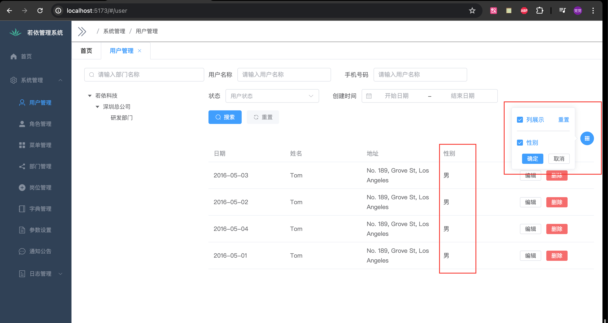

   创建组件页面`components/tableColumn.vue`

   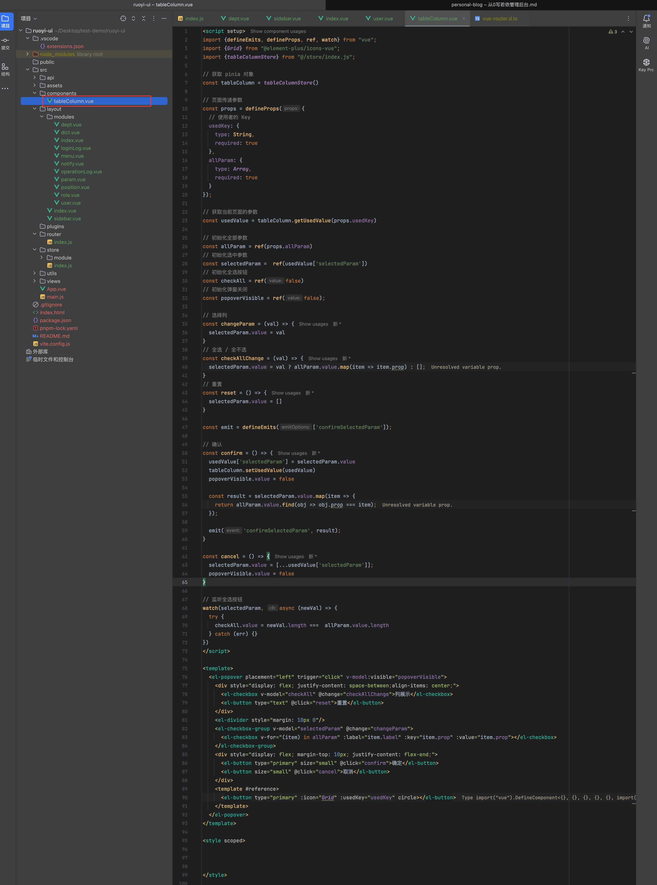

   ```vue
   <script setup>
   import {defineEmits, defineProps, ref, watch} from "vue";
   import {Grid} from "@element-plus/icons-vue";
   import {tableColumnStore} from "@/store/index.js";
   
   // 获取 pinia 对象
   const tableColumn = tableColumnStore()
   
   // 页面传递参数
   const props = defineProps({
     // 使用者的 Key
     usedKey: {
       type: String,
       required: true
     },
     allParam: {
       type: Array,
       required: true
     }
   });
   
   // 获取当前页面的参数
   const usedValue = tableColumn.getUsedValue(props.usedKey)
   
   // 初始化全部参数
   const allParam = ref(props.allParam)
   // 初始化选中参数
   const selectedParam =  ref(usedValue['selectedParam'])
   // 初始化全选按钮
   const checkAll = ref(false)
   // 初始化弹窗关闭
   const popoverVisible = ref(false);
   
   // 选择列
   const changeParam = (val) => {
     selectedParam.value = val
   }
   // 全选 / 全不选
   const checkAllChange = (val) => {
     selectedParam.value = val ? allParam.value.map(item => item.prop) : [];
   }
   // 重置
   const reset = () => {
     selectedParam.value = []
   }
   
   const emit = defineEmits(['confirmSelectedParam']);
   
   // 确认
   const confirm = () => {
     usedValue['selectedParam'] = selectedParam.value
     tableColumn.setUsedValue(usedValue)
     popoverVisible.value = false
   
     const result = selectedParam.value.map(item => {
       return allParam.value.find(obj => obj.prop === item);
     });
   
     emit('confirmSelectedParam', result);
   }
   
   const cancel = () => {
     selectedParam.value = [...usedValue['selectedParam']];
     popoverVisible.value = false
   }
   
   // 监听全选按钮
   watch(selectedParam, async (newVal) => {
     try {
       checkAll.value = newVal.length ===  allParam.value.length
     } catch (err) {}
   })
   </script>
   
   <template>
     <el-popover placement="left" trigger="click" v-model:visible="popoverVisible">
       <div style="display: flex; justify-content: space-between;align-items: center;">
         <el-checkbox v-model="checkAll" @change="checkAllChange">列展示</el-checkbox>
         <el-button type="text" @click="reset">重置</el-button>
       </div>
       <el-divider style="margin: 10px 0"/>
       <el-checkbox-group v-model="selectedParam" @change="changeParam">
         <el-checkbox v-for="(item) in allParam" :label="item.label" :key="item.prop" :value="item.prop"></el-checkbox>
       </el-checkbox-group>
       <div style="display: flex; margin-top: 10px; justify-content: flex-end;">
         <el-button type="primary" size="small" @click="confirm">确定</el-button>
         <el-button size="small" @click="cancel">取消</el-button>
       </div>
       <template #reference>
         <el-button type="primary" :icon="Grid" :usedKey="usedKey" circle></el-button>
       </template>
     </el-popover>
   </template>
   
   <style scoped>
   
   
   
   </style>
   
   ```

   完成后的`user.vue`页面

   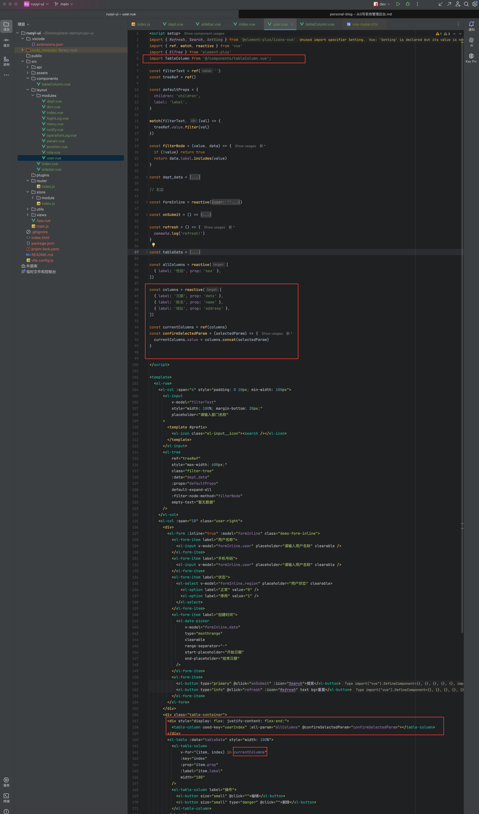

   ```vue
   <script setup>
   import { Refresh, Search, Setting } from '@element-plus/icons-vue'
   import { ref, watch, reactive } from 'vue'
   import { ElTree } from 'element-plus'
   import TableColumn from '@/components/tableColumn.vue';
   
   const filterText = ref('')
   const treeRef = ref()
   
   const defaultProps = {
     children: 'children',
     label: 'label',
   }
   
   watch(filterText, (val) => {
     treeRef.value.filter(val)
   })
   
   const filterNode = (value, data) => {
     if (!value) return true
     return data.label.includes(value)
   }
   
   const dept_data = [
     {
       label: '若依科技',
       children: [
         {
           label: '深圳总公司',
           children: [
             {
               label: '研发部门',
             },
           ],
         },
       ],
     }
   ]
   
   // 右边
   
   const formInline = reactive({
     user: '',
     region: '',
     date: '',
   })
   
   const onSubmit = () => {
     console.log('submit!')
     console.log(columns)
   }
   
   const refresh = () => {
     console.log('refresh!')
   }
   
   const tableData = [
     {
       date: '2016-05-03',
       name: 'Tom',
       address: 'No. 189, Grove St, Los Angeles',
       sex: '男'
     },
     {
       date: '2016-05-02',
       name: 'Tom',
       address: 'No. 189, Grove St, Los Angeles',
       sex: '男'
     },
     {
       date: '2016-05-04',
       name: 'Tom',
       address: 'No. 189, Grove St, Los Angeles',
       sex: '男'
     },
     {
       date: '2016-05-01',
       name: 'Tom',
       address: 'No. 189, Grove St, Los Angeles',
       sex: '男'
     },
   ]
   
   const allColumns = reactive([
     { label: '性别', prop: 'sex' },
   ])
   
   const columns = reactive([
     { label: '日期', prop: 'date' },
     { label: '姓名', prop: 'name' },
     { label: '地址', prop: 'address' },
   ])
   
   const currentColumns = ref(columns)
   const confirmSelectedParam = (selectedParam) => {
     currentColumns.value = columns.concat(selectedParam)
   }
   
   
   </script>
   
   <template>
     <el-row>
       <el-col :span="6" style="padding: 0 10px; min-width: 100px">
         <el-input
             v-model="filterText"
             style="width: 100%; margin-bottom: 20px;"
             placeholder="请输入部门名称"
         >
           <template #prefix>
             <el-icon class="el-input__icon"><search /></el-icon>
           </template>
         </el-input>
         <el-tree
             ref="treeRef"
             style="max-width: 600px;"
             class="filter-tree"
             :data="dept_data"
             :props="defaultProps"
             default-expand-all
             :filter-node-method="filterNode"
             empty-text="暂无数据"
         />
       </el-col>
       <el-col :span="18" class="user-right">
         <div>
           <el-form :inline="true" :model="formInline" class="demo-form-inline">
             <el-form-item label="用户名称">
               <el-input v-model="formInline.user" placeholder="请输入用户名称" clearable />
             </el-form-item>
             <el-form-item label="手机号码">
               <el-input v-model="formInline.user" placeholder="请输入用户名称" clearable />
             </el-form-item>
             <el-form-item label="状态">
               <el-select v-model="formInline.region" placeholder="用户状态" clearable>
                 <el-option label="正常" value="0" />
                 <el-option label="停用" value="1" />
               </el-select>
             </el-form-item>
             <el-form-item label="创建时间">
               <el-date-picker
                   v-model="formInline.date"
                   type="monthrange"
                   clearable
                   range-separator="-"
                   start-placeholder="开始日期"
                   end-placeholder="结束日期"
               />
             </el-form-item>
             <el-form-item>
               <el-button type="primary" @click="onSubmit" :icon="Search">搜索</el-button>
               <el-button type="info" @click="refresh" :icon="Refresh" text bg>重置</el-button>
             </el-form-item>
           </el-form>
         </div>
         <div class="table-container">
           <div style="display: flex; justify-content: flex-end;">
             <table-column used-key="userIndex" :all-param="allColumns" @confirmSelectedParam="confirmSelectedParam"></table-column>
           </div>
           <el-table :data="tableData" style="width: 100%">
             <el-table-column
                 v-for="(item, index) in currentColumns"
                 :key="index"
                 :prop="item.prop"
                 :label="item.label"
                 width="180"
             />
             <el-table-column label="操作">
               <el-button size="small" @click="">编辑</el-button>
               <el-button size="small" type="danger" @click="">删除</el-button>
             </el-table-column>
           </el-table>
         </div>
       </el-col>
     </el-row>
   </template>
   
   <style scoped lang="scss">
   .el-row {
     margin-bottom: 20px;
   }
   .el-row:last-child {
     margin-bottom: 0;
   }
   .el-col {
     border-radius: 4px;
   }
   
   .grid-content {
     border-radius: 4px;
     min-height: 36px;
   }
   
   .demo-form-inline .el-input {
     --el-input-width: 220px;
   }
   
   .demo-form-inline .el-select {
     --el-select-width: 220px;
   }
   
   el-button {
     border: 1px solid black;
   }
   
   .table-container {
     position: relative;
   }
   </style>
   
   ```

   `tableConlume.js`

   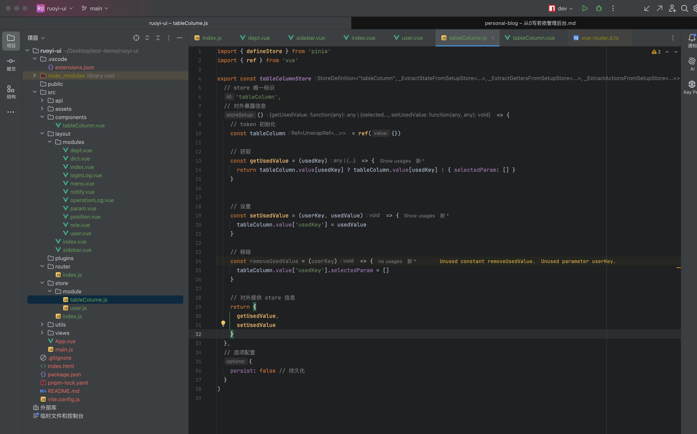

   ```js
   import { defineStore } from 'pinia'
   import { ref } from 'vue'
   
   export const tableColumnStore = defineStore(
     // store 唯一标识
     'tableColumn',
     // 对外暴露信息
     () => {
       // token 初始化
       const tableColumn = ref({})
       
       // 获取
       const getUsedValue = (usedKey) => {
         return tableColumn.value[usedKey] ? tableColumn.value[usedKey] : { selectedParam: [] }
       }
       
       
       // 设置
       const setUsedValue = (userKey, usedValue) => {
         tableColumn.value['usedKey'] = usedValue
       }
       
       // 移除
       const removeUsedValue = (userKey) => {
         tableColumn.value['usedKey'].selectedParam = []
       }
       
       // 对外提供 store 信息
       return {
         getUsedValue,
         setUsedValue
       }
     },
     // 选项配置
     {
       persist: false // 持久化
     }
   )
   
   ```


### 暂时完结

> 没做完为什么完结？
>
> 1. 是`暂时完结`,因为时间不太充裕。
> 2. 个人认为主要设计的内容已经完成（基本布局、接口对接、组件封装、数据持久化）
> 3. 后续有时间的话会继续完成后续（大概率不会全部实现）
>
> 是否认为阑尾？
>
> 不认为。
>
> 因为我会将代码上传的`github`上（包含全后端代码，有人需要练手不是很好的例子吗？刚好主要的都有实例参考，还可以`新手练习`
>
> 代码只会在`github`上，`gitee`暂时不会上传

1. <a href='https://github.com/HiCheer-O/ruoyi-ui'>前端项目地址</a>
2. <a href='https://github.com/HiCheer-O/ruoyi'>后端项目地址</a>
