### 页面布局

1. 清除默认的样式

   我们需要请求 vue 创建给我们的 css 样式、以及默认各种标签中自带的样式

    - 创建重置默认标签样式文件`reset.css`

      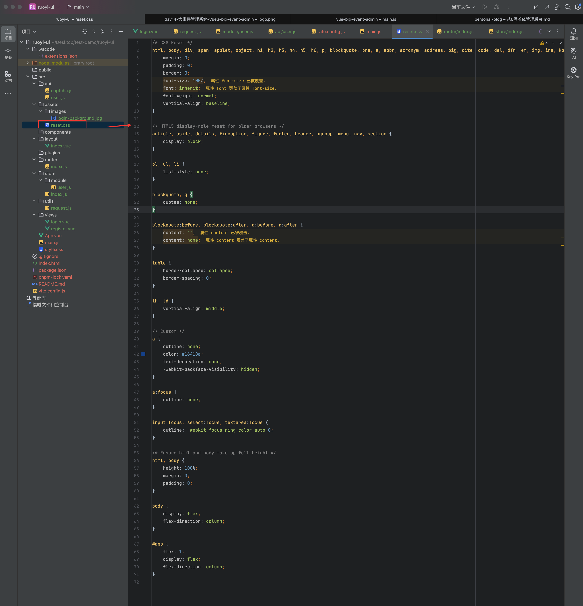

      ```css
      /* CSS Reset */
      html, body, div, span, applet, object, h1, h2, h3, h4, h5, h6, p, blockquote, pre, a, abbr, acronym, address, big, cite, code, del, dfn, em, img, ins, kbd, q, s, samp, small, strike, strong, sub, sup, tt, var, b, u, i, center, dl, dt, dd, ol, ul, li, fieldset, form, label, legend, table, caption, tbody, tfoot, thead, tr, th, td, article, aside, canvas, details, embed, figure, figcaption, footer, header, hgroup, menu, nav, output, ruby, section, summary, time, mark, audio, video {
          margin: 0;
          padding: 0;
          border: 0;
          font-size: 100%;
          font: inherit;
          font-weight: normal;
          vertical-align: baseline;
      }
      
      /* HTML5 display-role reset for older browsers */
      article, aside, details, figcaption, figure, footer, header, hgroup, menu, nav, section {
          display: block;
      }
      
      ol, ul, li {
          list-style: none;
      }
      
      blockquote, q {
          quotes: none;
      }
      
      blockquote:before, blockquote:after, q:before, q:after {
          content: '';
          content: none;
      }
      
      table {
          border-collapse: collapse;
          border-spacing: 0;
      }
      
      th, td {
          vertical-align: middle;
      }
      
      /* Custom */
      a {
          outline: none;
          color: #16418a;
          text-decoration: none;
          -webkit-backface-visibility: hidden;
      }
      
      a:focus {
          outline: none;
      }
      
      input:focus, select:focus, textarea:focus {
          outline: -webkit-focus-ring-color auto 0;
      }
      
      /* Ensure html and body take up full height */
      html, body {
          height: 100%;
          margin: 0;
          padding: 0;
      }
      
      body {
          display: flex;
          flex-direction: column;
      }
      
      #app {
          flex: 1;
          display: flex;
          flex-direction: column;
      }
      
      ```

    - 引入`reset.css`,删除默认的`style.css`

      我们直接删掉`style.css`

      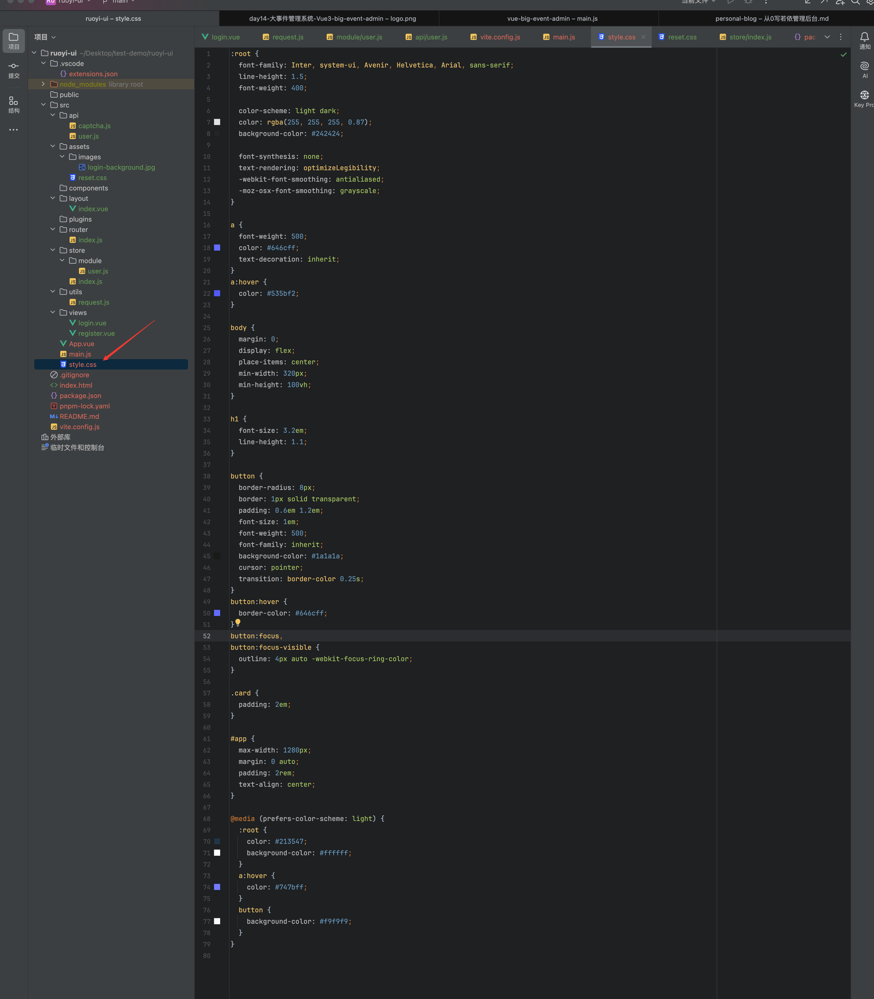

      引入我们的`reset.css`

      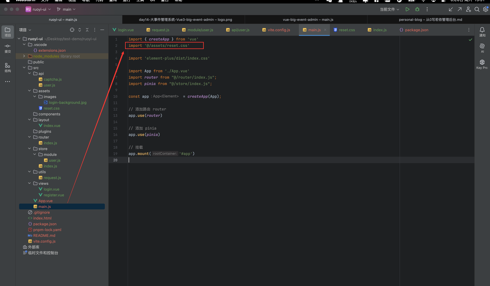

    - 验证是否成功

      我们看一下我们的 login 页面

      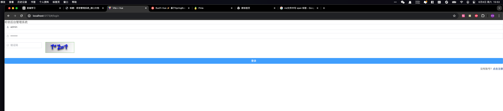

      发现样式没有了，也不居中了；别慌，也就说明我们上面重置的步骤生效了，接下来头疼的来了，画页面。

      不会画页面咋办，那就真的没办法，只能chatgpt、chrome、百度；要不然系统的学一下 html、css 了，我这里就不系统介绍了，后面的就直接贴代码了，自己去挑样式了。


2. 登录页样式

   效果

   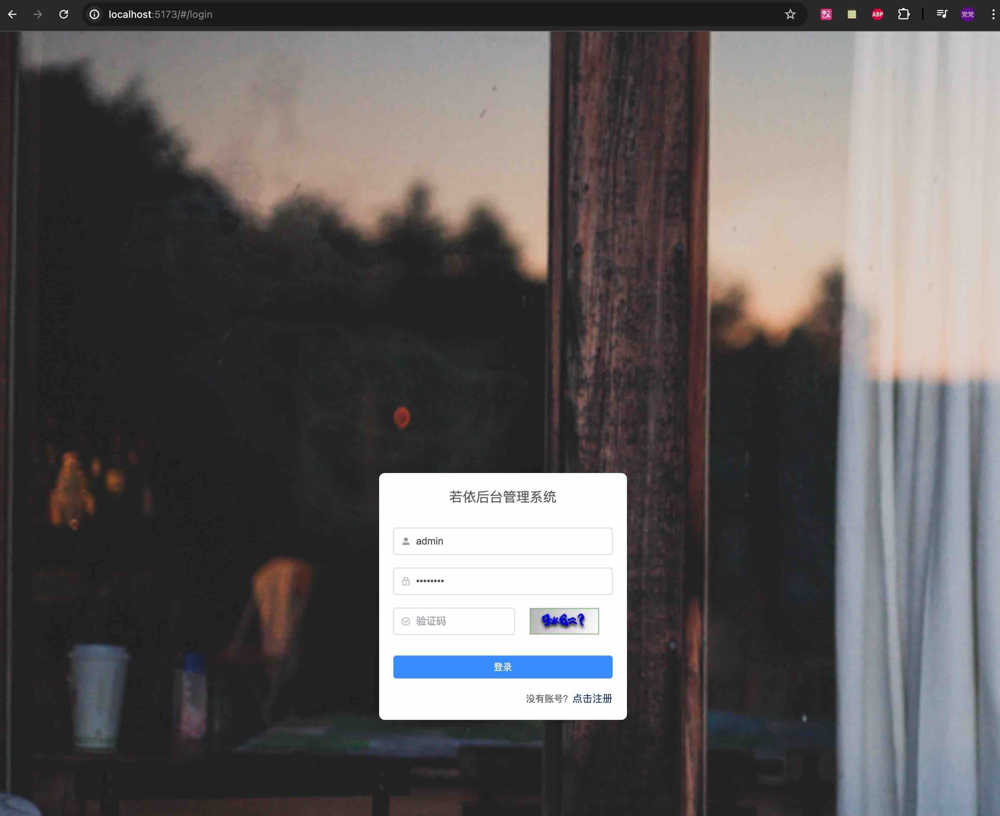

   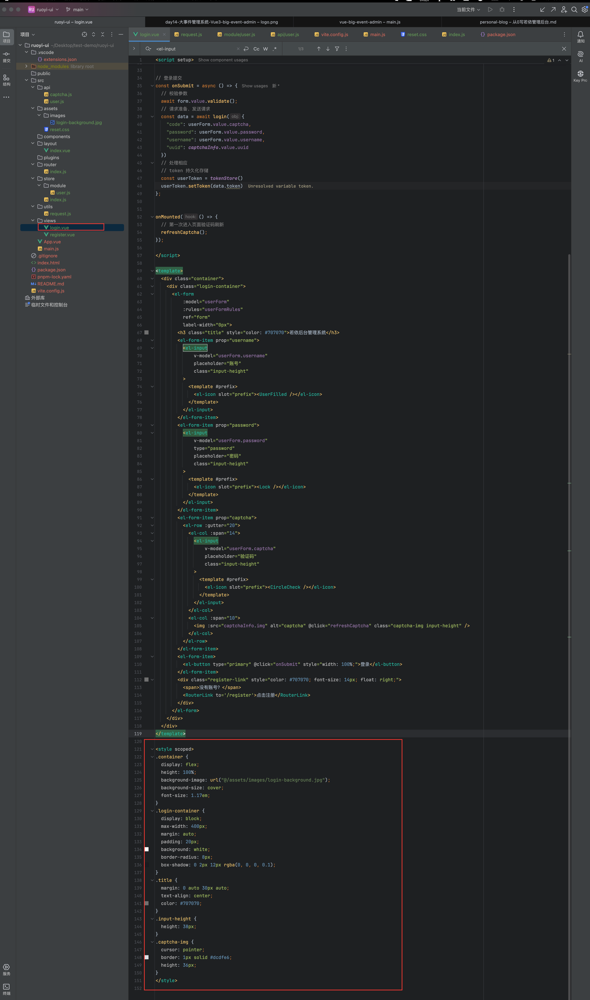

   ```css
   .container {
     display: flex;
     height: 100%;
     background-image: url("@/assets/images/login-background.jpg");
     background-size: cover;
     font-size: 1.17em;
   }
   .login-container {
     display: block;
     max-width: 400px;
     margin: auto;
     padding: 20px;
     background: white;
     border-radius: 8px;
     box-shadow: 0 2px 12px rgba(0, 0, 0, 0.1);
   }
   .title {
     margin: 0 auto 30px auto;
     text-align: center;
     color: #707070;
   }
   .input-height {
     height: 38px;
   }
   .captcha-img {
     cursor: pointer;
     border: 1px solid #dcdfe6;
     height: 36px;
   }
   ```

3. 主页

    - 分析

      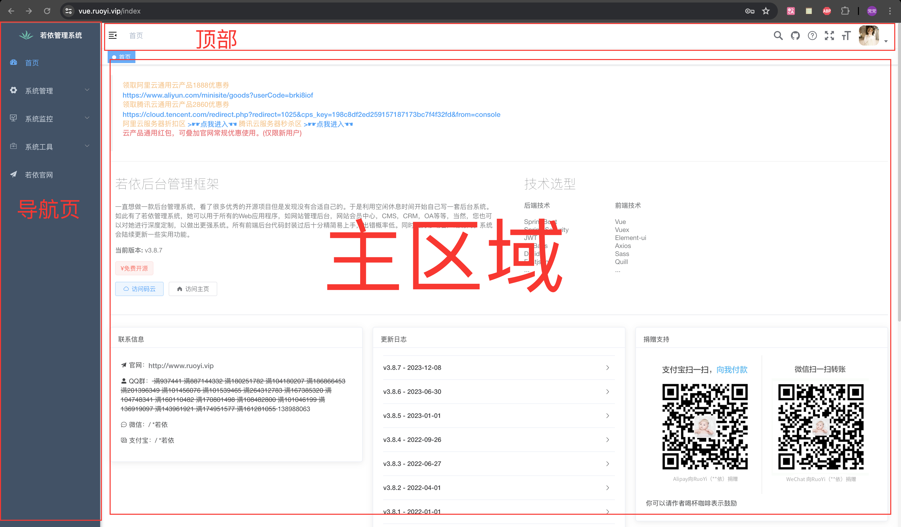

      也就分三个区域，从 <a href='https://element-plus.org/zh-CN/component/container.html'>element-ui</a> 中选择类似布局

      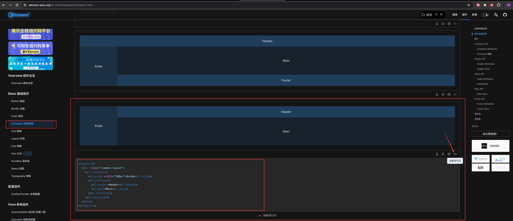

    - 实现

      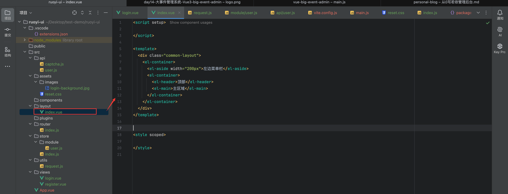

      ```vue
      <script setup>
      
      </script>
      
      <template>
        <div class="common-layout">
          <el-container>
            <el-aside width="200px">左边菜单栏</el-aside>
            <el-container>
              <el-header>顶部</el-header>
              <el-main>主区域</el-main>
            </el-container>
          </el-container>
        </div>
      </template>
      
      
      <style scoped>
      
      </style>
      
      ```

      配置`router`看一下效果

      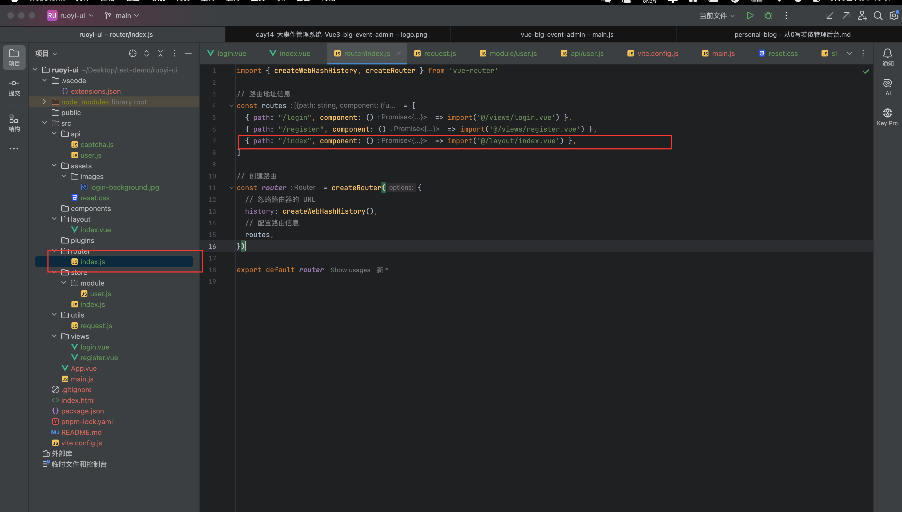

      ```js
          { path: "/index", component: () => import('@/layout/index.vue') },
      ```

      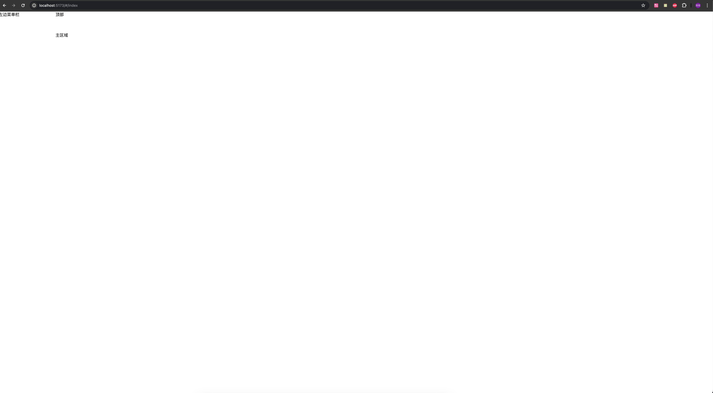

      好像生效了，不明显，那就加个背景色

      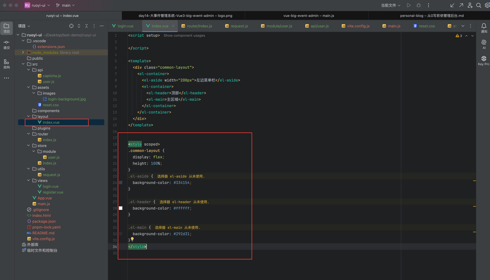

      ```css
      .common-layout {
        display: flex;
        height: 100%;
      }
      .el-aside {
        background-color: #334154;
      }
      
      .el-header {
        background-color: #ffffff;
      }
      
      .el-main {
        background-color: #292d31;
      }
      ```

      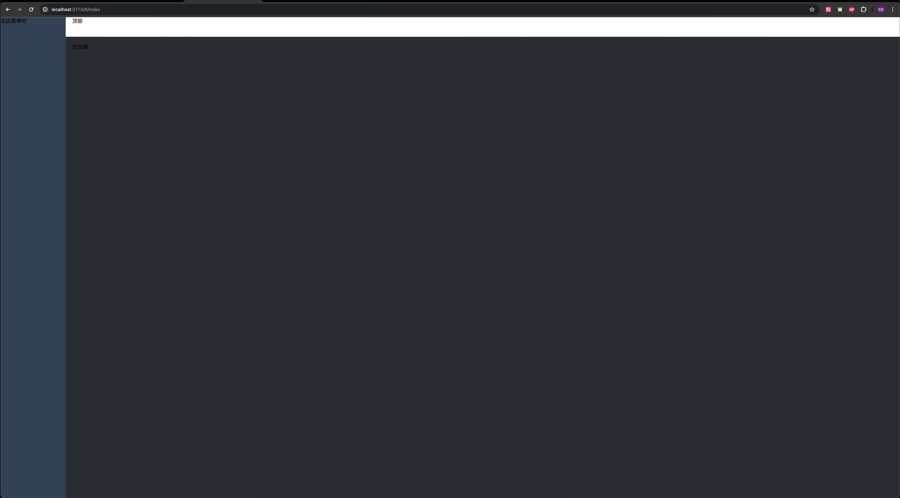

      可以了。

4. 侧边导航样式优化

    - 菜单正常显示、并且菜单可以折叠

      首先我们分析一下样式结构

      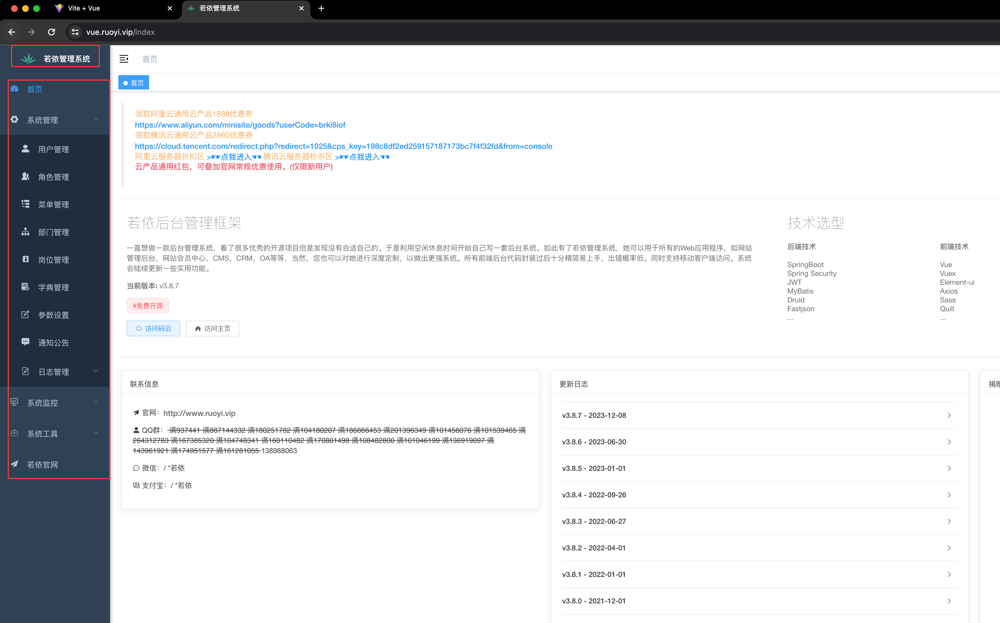

      在没有看 `ruoyi`代码之前，我觉得菜单分两个部分`上面的图标和若依管理系统`与`下面的菜单`,但是我这样理解之后发现了一个问题，也就是***菜单无法折叠***，因为菜单折叠是在element-ui的菜单组件中才有的；因此我将侧边栏整体看成一个部分，单独对第一个菜单项做单独处理。

      先看一下我们需要的组件

      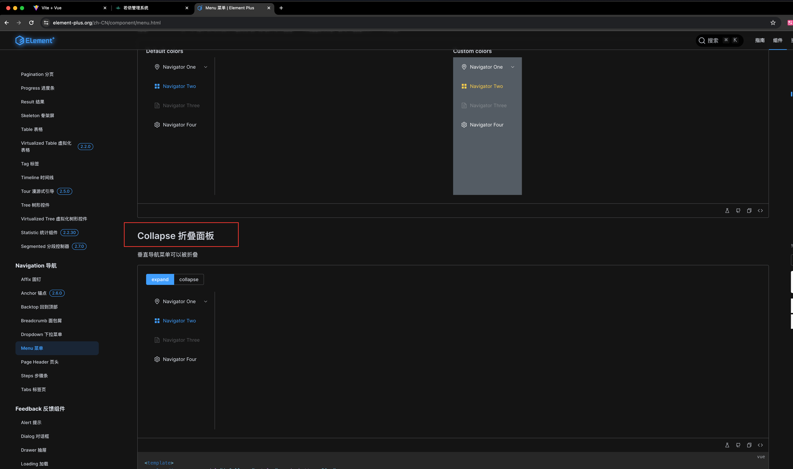

      官网代码如下

      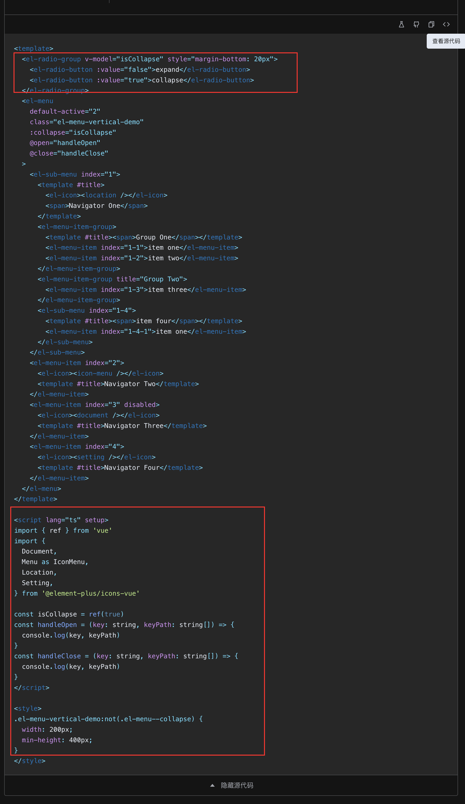

      我们可以看到`是否折叠`是根据`isCollapse`来判断的，我们触发`是否折叠`折叠的按钮是在另外一个页面，也就是`主页面顶部`，因此我们需要从另外一个页面触发侧边栏是否折叠。下面我直接给代码，你自己分析一下。

      `sidebar.vue`页面

      ```vue
      <template>
        <el-menu
            background-color="#304156"
            text-color="#85909f"
            default-active="1"
            class="sidebar-menu"
            :collapse="isCollapse"
            router
        >
          <!--顶部系统信息-->
          <el-menu-item index="/index" style="height: 56px; padding: 0 20px;">
            
            <span style="font-size: 14px; color: #ffffff">
                  若依管理系统
              </span>
          </el-menu-item>
          <!--首页-->
          <el-menu-item index="/index">
            <el-icon>
              <HomeFilled/>
            </el-icon>
            <span>首页</span>
          </el-menu-item>
          <!--系统管理-->
          <el-sub-menu index="/system">
            <template #title>
              <el-icon>
                <Setting/>
              </el-icon>
              <span>系统管理</span>
            </template>
            <el-menu-item index="/system/user">
              <el-icon>
                <User/>
              </el-icon>
              <span>用户管理</span></el-menu-item>
            <el-menu-item index="/system/role">
              <el-icon>
                <UserFilled/>
              </el-icon>
              <span>角色管理</span></el-menu-item>
            <el-menu-item index="2-3">
              <el-icon>
                <Menu/>
              </el-icon>
              <span>菜单管理</span></el-menu-item>
            <el-menu-item index="2-4">
              <el-icon>
                <Share/>
              </el-icon>
              <span>部门管理</span></el-menu-item>
            <el-menu-item index="2-5">
              <el-icon>
                <CirclePlusFilled/>
              </el-icon>
              <span>岗位管理</span></el-menu-item>
            <el-menu-item index="2-6">
              <el-icon>
                <Notebook/>
              </el-icon>
              <span>字典管理</span></el-menu-item>
            <el-menu-item index="2-7">
              <el-icon>
                <Document/>
              </el-icon>
              <span>参数设置</span></el-menu-item>
            <el-menu-item index="2-8">
              <el-icon>
                <ChatDotRound/>
              </el-icon>
              <span>通知公告</span></el-menu-item>
            <el-sub-menu index="2-9">
              <template #title>
                <el-icon>
                  <Tickets/>
                </el-icon>
                <span>日志管理</span></template>
              <el-menu-item index="2-9-1">
                <el-icon>
                  <Memo/>
                </el-icon>
                <span>操作日志</span></el-menu-item>
              <el-menu-item index="2-9-2">
                <el-icon>
                  <DataLine/>
                </el-icon>
                <span>登录日志</span></el-menu-item>
            </el-sub-menu>
          </el-sub-menu>
        <!--系统监控-->
        <el-sub-menu index="3">
          <template #title>
            <el-icon><Monitor /></el-icon>
            <span>系统监控</span>
          </template>
          <el-menu-item index="3-1">
            <el-icon><DataLine /></el-icon>
            <span>在线用户</span></el-menu-item>
          <el-menu-item index="3-2">
            <el-icon><Postcard /></el-icon>
            <span>定时任务</span></el-menu-item>
          <el-menu-item index="3-3">
            <el-icon><TrendCharts /></el-icon>
            <span>数据监控</span></el-menu-item>
          <el-menu-item index="3-4">
            <el-icon>
              <Share/>
            </el-icon>
            <span>缓存监控</span></el-menu-item>
          <el-menu-item index="3-5">
            <el-icon>
              <CirclePlusFilled/>
            </el-icon>
            <span>缓存列表</span></el-menu-item>
        </el-sub-menu>
        </el-menu>
      </template>
      
      <script lang="ts" setup>
      import {
        Document,
        Setting,
        HomeFilled,
        User,
        UserFilled,
        Share,
        CirclePlusFilled,
        Notebook,
        ChatDotRound,
        Tickets,
        Memo,
        DataLine,
        Menu, Monitor, Postcard, TrendCharts,
      } from '@element-plus/icons-vue'
      import { defineProps } from 'vue';
      
      // 是否菜单塌陷 true：塌陷，false：不塌陷
      const props = defineProps({
        isCollapse: {
          type: Boolean,
          required: true
        }
      })
      
      </script>
      
      <style lang="scss">
      .el-menu-vertical-demo:not(.el-menu--collapse) {
        width: 200px;
        min-height: 400px;
      }
      .sidebar-menu {
        height: 100%;
        border: 0;
      }
      span {
        font-size: 13px;
      }
      .logo-container {
        display: flex;
        width: 100%;
        height: 50px;
        align-items: center;
        justify-content: center;
      }
      
      .logo-container img {
        width: 32px;
        height: 32px;
        margin-right: 12px;
      }
      </style>
      
      ```

      这里我先配置前几个页面的跳转链接，方便后面测试。

      `index.vue`主页面

      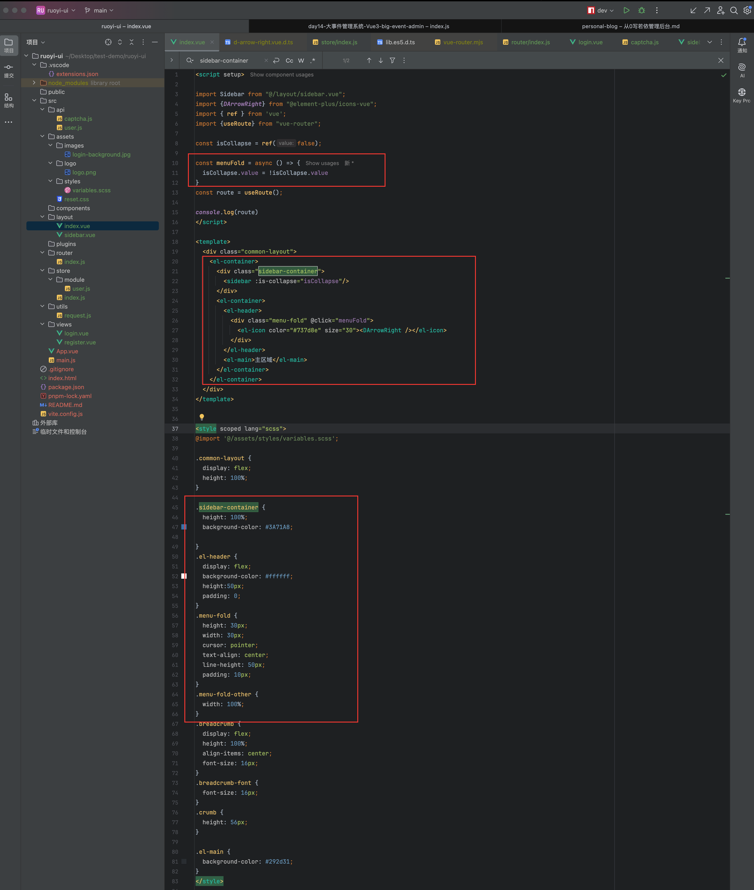

      ```vue
      <script setup>
      
      import Sidebar from "@/layout/sidebar.vue";
      import {DArrowRight} from "@element-plus/icons-vue";
      import { ref } from 'vue';
      import {useRoute} from "vue-router";
      
      const isCollapse = ref(false);
      
      const menuFold = async () => {
        isCollapse.value = !isCollapse.value
      }
      const route = useRoute();
      
      console.log(route)
      </script>
      
      <template>
        <div class="common-layout">
          <el-container>
            <div class="sidebar-container">
              <sidebar :is-collapse="isCollapse"/>
            </div>
            <el-container>
              <el-header>
                <div class="menu-fold" @click="menuFold">
                  <el-icon color="#737d8e" size="30"><DArrowRight /></el-icon>
                </div>
              </el-header>
              <el-main>主区域</el-main>
            </el-container>
          </el-container>
        </div>
      </template>
      
      
      <style scoped lang="scss">
      @import '@/assets/styles/variables.scss';
      
      .common-layout {
        display: flex;
        height: 100%;
      }
      
      .sidebar-container {
        height: 100%;
        background-color: #3A71A8;
      
      }
      .el-header {
        display: flex;
        background-color: #ffffff;
        height:50px;
        padding: 0;
      }
      .menu-fold {
        height: 30px;
        width: 30px;
        cursor: pointer;
        text-align: center;
        line-height: 50px;
        padding: 10px;
      }
      .menu-fold-other {
        width: 100%;
      }
      .breadcrumb {
        display: flex;
        height: 100%;
        align-items: center;
        font-size: 16px;
      }
      .breadcrumb-font {
        font-size: 16px;
      }
      .crumb {
        height: 56px;
      }
      
      .el-main {
        background-color: #292d31;
      }
      </style>
      
      ```

      效果

      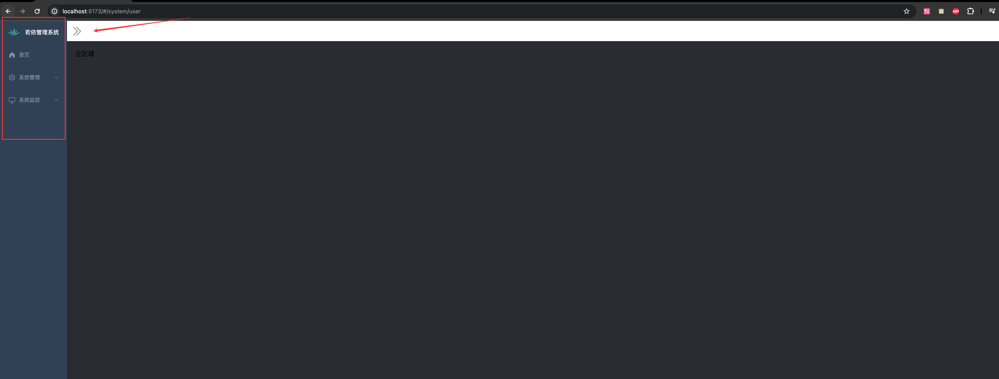

    - 进一步优化（页面顶部需要菜单路径）

      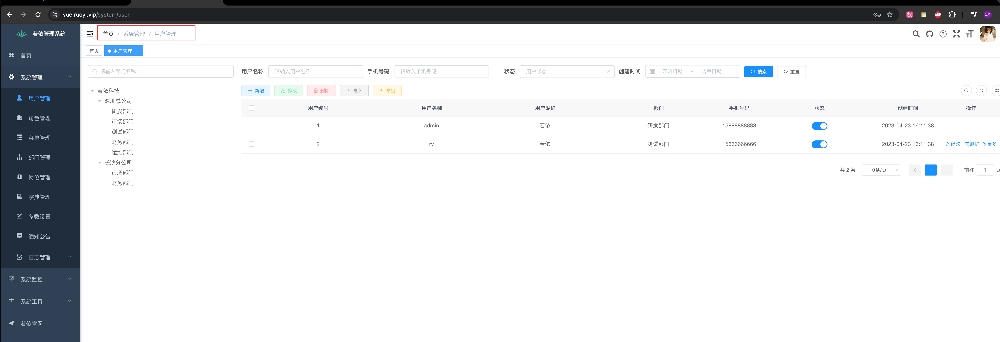

      这里我们需要做两点：1、菜单绑定路由（确定点击菜单可以跳转正确的页面），2、点击菜单在主页面可以获取路由信息（这样才可渲染菜单路径）

      菜单绑定路由（调整路由页面）：

      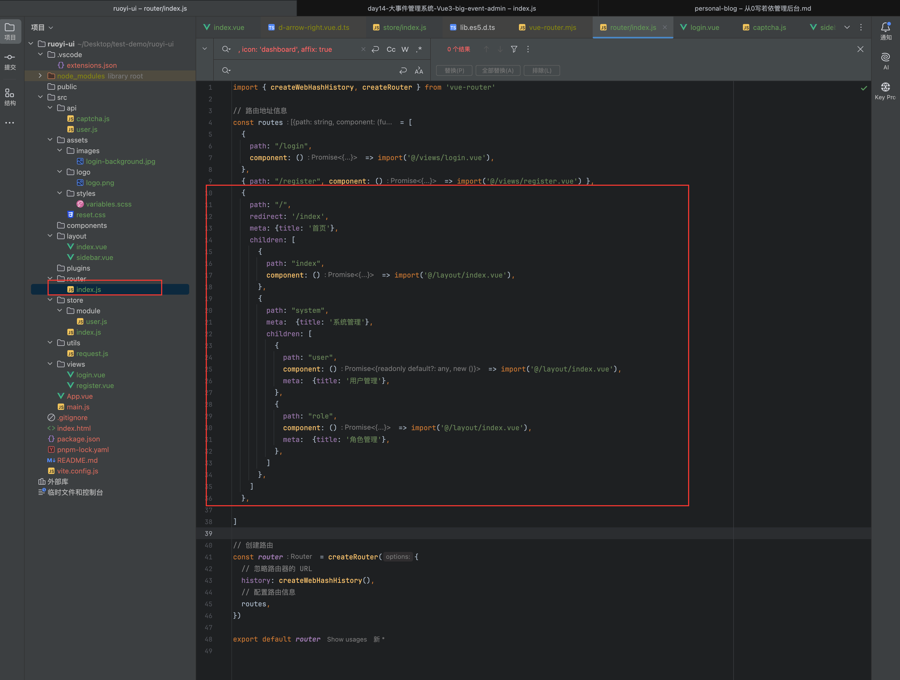

      ```js
      {
              path: "/",
              redirect: '/index',
              meta: {title: '首页'},
              children: [
                  {
                      path: "index",
                      component: () => import('@/layout/index.vue'),
                  },
                  {
                      path: "system",
                      meta:  {title: '系统管理'},
                      children: [
                          {
                              path: "user",
                              component: () => import('@/layout/user.vue'),
                              meta:  {title: '用户管理'},
                          },
                          {
                              path: "role",
                              component: () => import('@/layout/index.vue'),
                              meta:  {title: '角色管理'},
                          },
                      ]
                  },
              ]
          },
      ```

      注意一下：我这样配置路由是有问题的，在`path:"/"`这里并没有配置`component`，在点击`用户管理`的时候就会导致直接在一个新的新页面打开了 user 页面，因此我们需要调整一下

      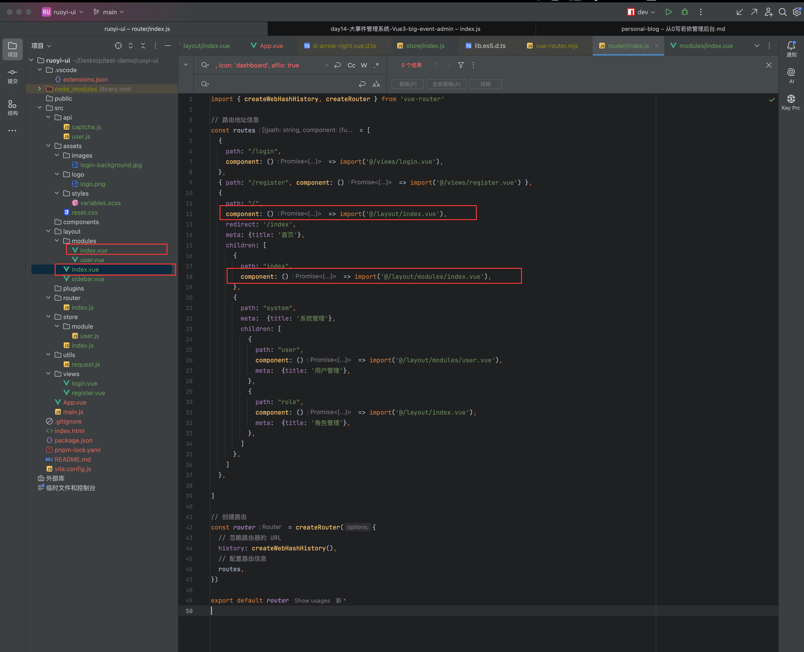

      ```js
      import { createWebHashHistory, createRouter } from 'vue-router'
      
      // 路由地址信息
      const routes = [
          {
              path: "/login",
              component: () => import('@/views/login.vue'),
          },
          { path: "/register", component: () => import('@/views/register.vue') },
          {
              path: "/",
              component: () => import('@/layout/index.vue'),
              redirect: '/index',
              meta: {title: '首页'},
              children: [
                  {
                      path: "index",
                      component: () => import('@/layout/modules/index.vue'),
                  },
                  {
                      path: "system",
                      meta:  {title: '系统管理'},
                      children: [
                          {
                              path: "user",
                              component: () => import('@/layout/modules/user.vue'),
                              meta:  {title: '用户管理'},
                          },
                          {
                              path: "role",
                              component: () => import('@/layout/index.vue'),
                              meta:  {title: '角色管理'},
                          },
                      ]
                  },
              ]
          },
      
      ]
      
      // 创建路由
      const router = createRouter({
          // 忽略路由器的 URL
          history: createWebHashHistory(),
          // 配置路由信息
          routes,
      })
      
      export default router
      
      ```

      我们调整一下主页面

      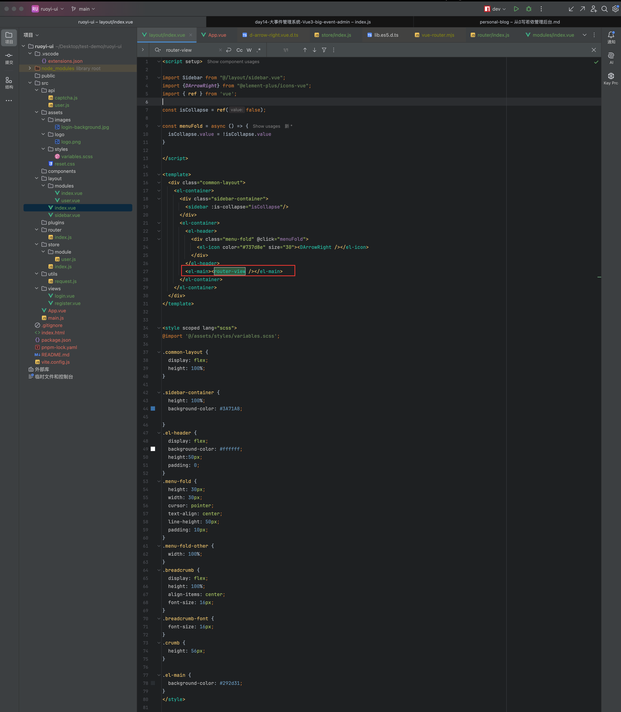

      这样就可以正确显示，效果

      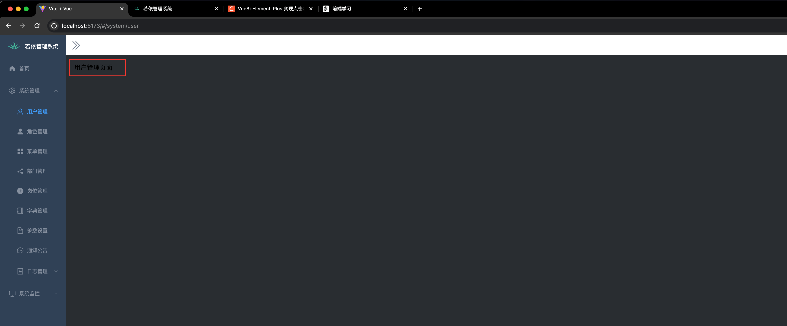

5. 路由菜单优化

   > 为什么要做优化呢？
   >
   > 因为我发现关于`菜单的名称`在两个地方`router/index.js`和`layout.sidebar.vue`都存在；同样的菜单名称，配置两个地方相对来说，调整起来不是很方便，不容易维护，那我们就调整一下。
   >
   > 思路：在`router/index.js`配置完，`layout.sidebar.vue`去获取这些菜单，自动生成`树形结构的菜单`。

    - 首先，路由定义

      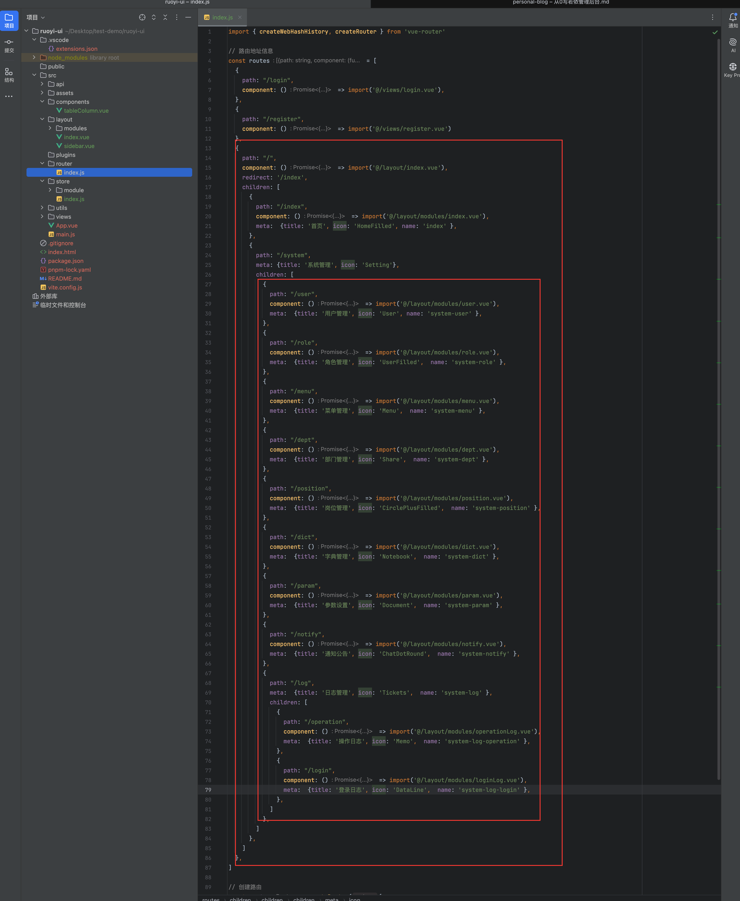

      ```js
      import { createWebHashHistory, createRouter } from 'vue-router'
      
      // 路由地址信息
      const routes = [
          {
              path: "/login",
              component: () => import('@/views/login.vue'),
          },
          {
              path: "/register",
              component: () => import('@/views/register.vue')
          },
          {
              path: "/",
              component: () => import('@/layout/index.vue'),
              redirect: '/index',
              children: [
                  {
                      path: "/index",
                      component: () => import('@/layout/modules/index.vue'),
                      meta:  {title: '首页', icon: 'HomeFilled', name: 'index' },
                  },
                  {
                      path: "/system",
                      meta: {title: '系统管理', icon: 'Setting'},
                      children: [
                          {
                              path: "/user",
                              component: () => import('@/layout/modules/user.vue'),
                              meta:  {title: '用户管理', icon: 'User', name: 'system-user' },
                          },
                          {
                              path: "/role",
                              component: () => import('@/layout/modules/role.vue'),
                              meta:  {title: '角色管理', icon: 'UserFilled',  name: 'system-role' },
                          },
                          {
                              path: "/menu",
                              component: () => import('@/layout/modules/menu.vue'),
                              meta:  {title: '菜单管理', icon: 'Menu',  name: 'system-menu' },
                          },
                          {
                              path: "/dept",
                              component: () => import('@/layout/modules/dept.vue'),
                              meta:  {title: '部门管理', icon: 'Share',  name: 'system-dept' },
                          },
                          {
                              path: "/position",
                              component: () => import('@/layout/modules/position.vue'),
                              meta:  {title: '岗位管理', icon: 'CirclePlusFilled',  name: 'system-position' },
                          },
                          {
                              path: "/dict",
                              component: () => import('@/layout/modules/dict.vue'),
                              meta:  {title: '字典管理', icon: 'Notebook',  name: 'system-dict' },
                          },
                          {
                              path: "/param",
                              component: () => import('@/layout/modules/param.vue'),
                              meta:  {title: '参数设置', icon: 'Document',  name: 'system-param' },
                          },
                          {
                              path: "/notify",
                              component: () => import('@/layout/modules/notify.vue'),
                              meta:  {title: '通知公告', icon: 'ChatDotRound',  name: 'system-notify' },
                          },
                          {
                              path: "/log",
                              meta:  {title: '日志管理', icon: 'Tickets',  name: 'system-log' },
                              children: [
                                  {
                                      path: "/operation",
                                      component: () => import('@/layout/modules/operationLog.vue'),
                                      meta:  {title: '操作日志', icon: 'Memo',  name: 'system-log-operation' },
                                  },
                                  {
                                      path: "/login",
                                      component: () => import('@/layout/modules/loginLog.vue'),
                                      meta:  {title: '登录日志', icon: 'DataLine',  name: 'system-log-login' },
                                  },
                              ]
                          },
                      ]
                  },
              ]
          },
      ]
      
      // 创建路由
      const router = createRouter({
          // 忽略路由器的 URL
          history: createWebHashHistory(),
          // 配置路由信息
          routes,
      })
      
      export default router
      
      ```

      我们需要注意一下每个菜单配置都有一个`meta`字段，里面有三个参数`title：菜单名称`、`icon：菜单图标`和`name：页面名称`

    - 然后，关键创建一下这些新的页面

      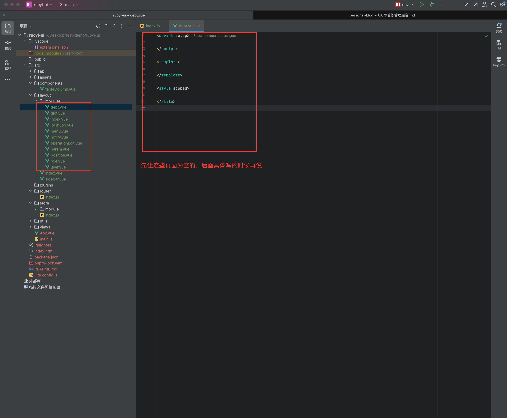

    - 最后，调整菜单页面了`sidebar.vue`

      ⚠️注意页面是调整最大的，先上代码，然后解释

      ```vue
      <template>
        <el-menu
            background-color="#304156"
            text-color="#85909f"
            :default-active="activeIndex"
            class="sidebar-menu"
            :collapse="isCollapse"
            :router="true"
            @select="handleMenuItemSelect"
        >
          <!-- 顶部系统信息 -->
          <el-menu-item index="/index" style="height: 56px; padding: 0 20px;">
            
            <span style="font-size: 14px; color: #ffffff">
              若依管理系统
            </span>
          </el-menu-item>
      
          <!-- 菜单项 -->
          <template v-for="item in mainMenuItems" :key="item.index">
            <el-menu-item v-if="!item.children" :index="item.index">
              <el-icon>
                <component :is="getIconComponent(item.icon)" />
              </el-icon>
              <span>{{ item.title }}</span>
            </el-menu-item>
            <el-sub-menu v-else :index="item.index">
              <template #title>
                <el-icon>
                  <component :is="getIconComponent(item.icon)" />
                </el-icon>
                <span>{{ item.title }}</span>
              </template>
              <template v-for="subItem in item.children" :key="subItem.index">
                <el-menu-item v-if="!subItem.children" :index="subItem.index">
                  <el-icon>
                    <component :is="getIconComponent(subItem.icon)" />
                  </el-icon>
                  <span>{{ subItem.title }}</span>
                </el-menu-item>
                <el-sub-menu v-else :index="subItem.index">
                  <template #title>
                    <el-icon>
                      <component :is="getIconComponent(subItem.icon)" />
                    </el-icon>
                    <span>{{ subItem.title }}</span>
                  </template>
                  <template v-for="sonItem in subItem.children" :key="sonItem.index">
                    <el-menu-item v-if="!sonItem.children" :index="sonItem.index">
                      <el-icon>
                        <component :is="getIconComponent(sonItem.icon)" />
                      </el-icon>
                      <span>{{ sonItem.title }}</span>
                    </el-menu-item>
                  </template>
                </el-sub-menu>
              </template>
            </el-sub-menu>
          </template>
        </el-menu>
      </template>
      
      <script lang="ts" setup>
      import * as Icons from '@element-plus/icons-vue';
      import { defineProps } from 'vue';
      import { useRouter } from 'vue-router';
      
      // 获取全部路由
      const router = useRouter();
      
      // 路由转菜单
      const generateMenuItems = (routers) => {
        return routers.map(route => {
          const menuItem = {
            index: route.path,
            title: route.meta?.title || '',
            icon: route.meta?.icon || '',
            name: route.meta?.name || '',
            children: route.children ? generateMenuItems(route.children) : null
          };
          return menuItem;
        });
      };
      
      const menuItems = generateMenuItems(router.options.routes);
      // 获取主要菜单
      const mainMenuItems = menuItems.find(item => item.index === '/')?.children || [];
      
      // 是否菜单塌陷 true：塌陷，false：不塌陷
      const props = defineProps({
        isCollapse: {
          type: Boolean,
          required: true
        },
        activeIndex: {
          type: String,
          required: true
        }
      });
      </script>
      
      <style lang="scss">
      .el-menu-vertical-demo:not(.el-menu--collapse) {
        width: 200px;
        min-height: 400px;
      }
      .sidebar-menu {
        height: 100%;
        border: 0;
      }
      span {
        font-size: 13px;
      }
      .logo-container {
        display: flex;
        width: 100%;
        height: 50px;
        align-items: center;
        justify-content: center;
      }
      
      .logo-container img {
        width: 32px;
        height: 32px;
        margin-right: 12px;
      }
      </style>
      
      ```

        1. 获取全部的路由，然后从路由中提取出菜单信息，这个菜单信息是有层级结构的（警告不影响，这里就忽略了）

      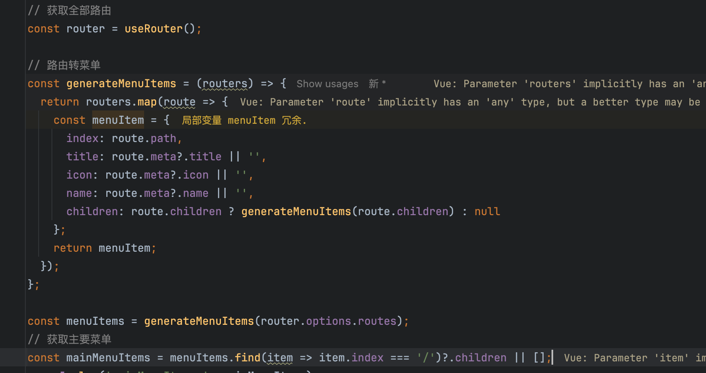

      `mainMenuItems`的具体结构如下

      ``` json
      [
          {
              "index": "/index",
              "title": "首页",
              "icon": "HomeFilled",
              "name": "index",
              "children": null
          },
          {
              "index": "/system",
              "title": "系统管理",
              "icon": "Setting",
              "name": "",
              "children": [
                  {
                      "index": "/user",
                      "title": "用户管理",
                      "icon": "User",
                      "name": "system-user",
                      "children": null
                  },
                  {
                      "index": "/role",
                      "title": "角色管理",
                      "icon": "UserFilled",
                      "name": "system-role",
                      "children": null
                  },
                  {
                      "index": "/menu",
                      "title": "菜单管理",
                      "icon": "Menu",
                      "name": "system-menu",
                      "children": null
                  },
                  {
                      "index": "/dept",
                      "title": "部门管理",
                      "icon": "Share",
                      "name": "system-dept",
                      "children": null
                  },
                  {
                      "index": "/position",
                      "title": "岗位管理",
                      "icon": "CirclePlusFilled",
                      "name": "system-position",
                      "children": null
                  },
                  {
                      "index": "/dict",
                      "title": "字典管理",
                      "icon": "Notebook",
                      "name": "system-dict",
                      "children": null
                  },
                  {
                      "index": "/param",
                      "title": "参数设置",
                      "icon": "Document",
                      "name": "system-param",
                      "children": null
                  },
                  {
                      "index": "/notify",
                      "title": "通知公告",
                      "icon": "ChatDotRound",
                      "name": "system-notify",
                      "children": null
                  },
                  {
                      "index": "/log",
                      "title": "日志管理",
                      "icon": "Tickets",
                      "name": "system-log",
                      "children": [
                          {
                              "index": "/operation",
                              "title": "操作日志",
                              "icon": "Memo",
                              "name": "system-log-operation",
                              "children": null
                          },
                          {
                              "index": "/login",
                              "title": "登录日志",
                              "icon": "DataLine",
                              "name": "system-log-login",
                              "children": null
                          }
                      ]
                  }
              ]
          }
      ]
      ```

        2. 改造页面，将`mainMenuItems`的数据渲染上去

      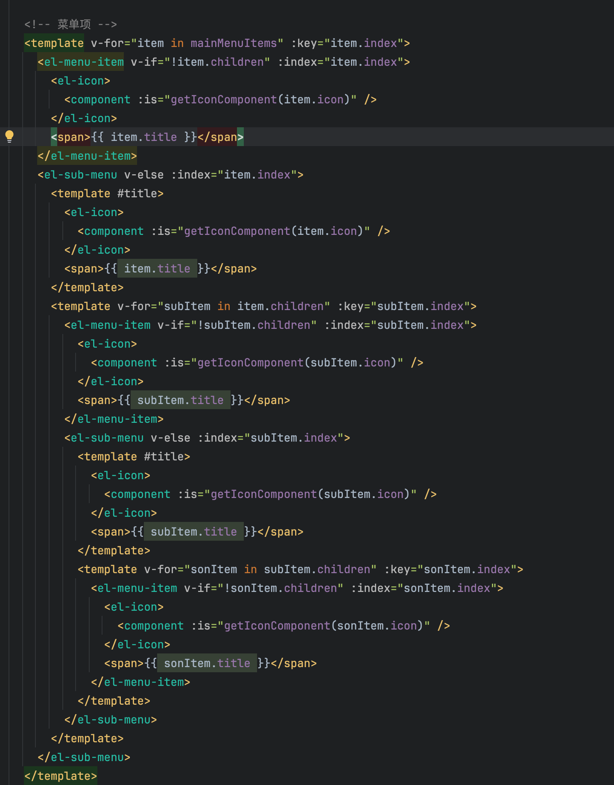

      里面有个方法`getIconComponent`是获取图标的，如果我们直接将图标的字符串放上是不生效的。

      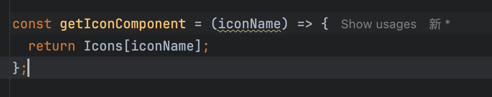

      ⚠️注意：我这里一开始的时候是确定了菜单只有`三层`，所以这里的代码适用于`小于等于3层`；如果你的`大于三层`，只需要在最后一层中自己接着`套娃`.

        3. 菜单路径

      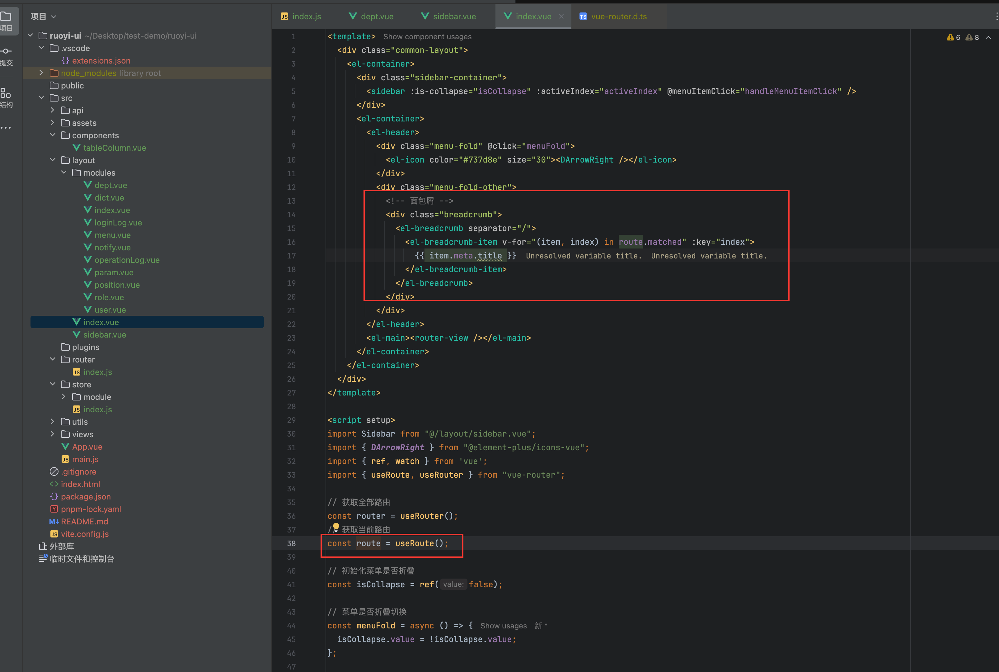

      ```vue
      <div class="menu-fold-other">
        <!-- 面包屑 -->
        <div class="breadcrumb">
          <el-breadcrumb separator="/">
            <el-breadcrumb-item v-for="(item, index) in route.matched" :key="index">
              {{ item.meta.title }}
            </el-breadcrumb-item>
          </el-breadcrumb>
        </div>
      </div>
      <script setup>
      import { useRoute, useRouter } from "vue-router";
      const route = useRoute();
      </script>
      ```

      OK，完成

      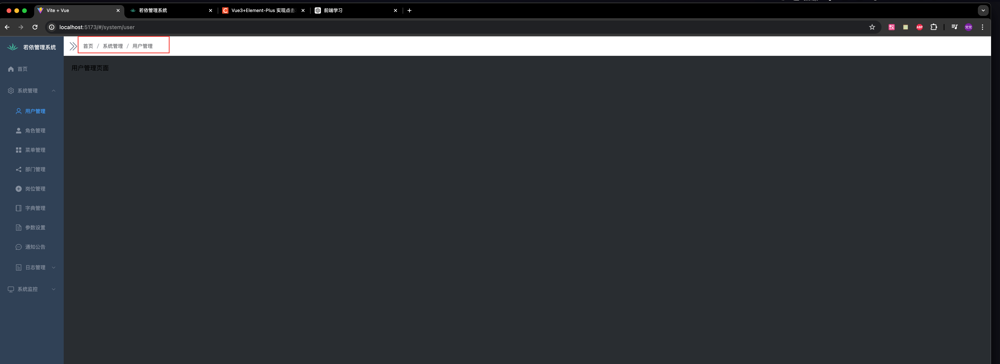

        4. 顶部标签页

      > 细节说明一下：
      >
      > 1. 点击`新的`菜单才会出现，重复点击不会再创建信息的
      > 2. `首页`是固定的第一个，不可以删除
      > 3. 有多个标签页面被打开，强制刷新页面时，其他页面会被关闭，当前页面会被保留
      > 4. 鼠标点击标签页面，菜单会切换到对应的菜，当选中的标签页的菜单处于折叠状态，会帮你打开折叠定位到对应的菜单

      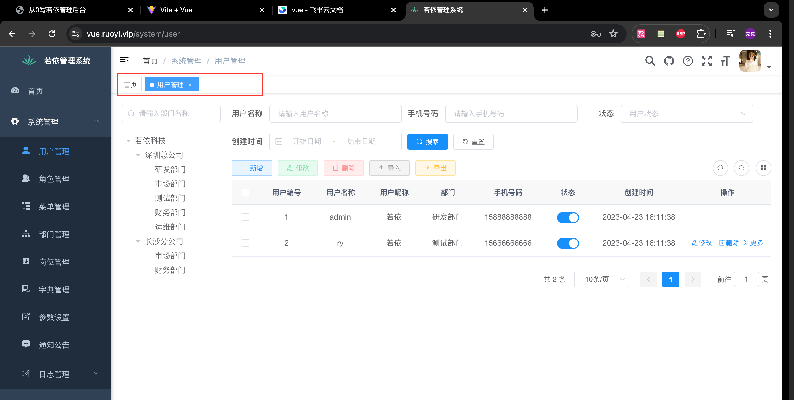

      这里是 <a href='https://element-plus.org/zh-CN/component/tabs.html#tabs-%E6%A0%87%E7%AD%BE%E9%A1%B5'>element-ui-标签页</a> 对应的标签页

      具体代码

      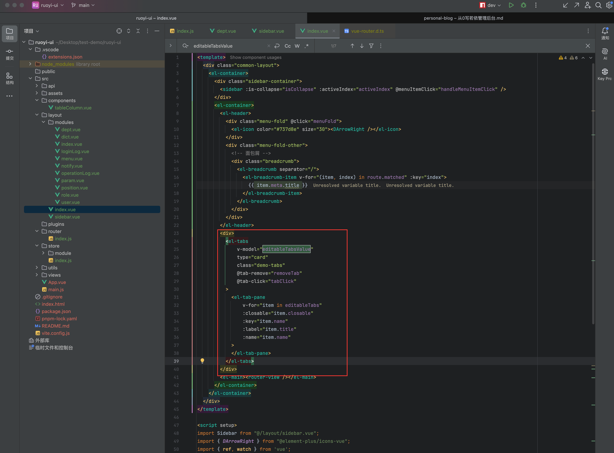

      ```vue
      <div>
        <el-tabs
                 v-model="editableTabsValue"
                 type="card"
                 class="demo-tabs"
                 @tab-remove="removeTab"
                 @tab-click="tabClick"
                 >
          <el-tab-pane
                       v-for="item in editableTabs"
                       :closable="item.closable"
                       :key="item.name"
                       :label="item.title"
                       :name="item.name"
                       >
          </el-tab-pane>
        </el-tabs>
      </div>
      ```

      这里面的方法如下：

      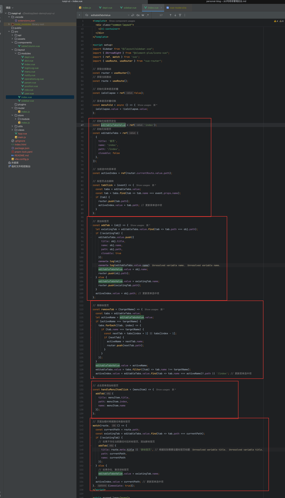

      ```vue
      <script setup>
      import Sidebar from "@/layout/sidebar.vue";
      import { DArrowRight } from "@element-plus/icons-vue";
      import { ref, watch } from 'vue';
      import { useRoute, useRouter } from "vue-router";
      
      // 获取全部路由
      const router = useRouter();
      // 获取当前路由
      const route = useRoute();
      
      // 初始化菜单是否折叠
      const isCollapse = ref(false);
      
      // 菜单是否折叠切换
      const menuFold = async () => {
        isCollapse.value = !isCollapse.value;
      };
      
      // 初始化标签页定位
      const editableTabsValue = ref('index');
      // 初始化标签页
      const editableTabs = ref([
        {
          title: '首页',
          name: 'index',
          path: '/index',
          closable: false
        },
      ]);
      
      // 当前选中的菜单项
      const activeIndex = ref(router.currentRoute.value.path);
      
      // 标签页点击跳转
      const tabClick = (event) => {
        const tabs = editableTabs.value;
        const tab = tabs.find(tab => tab.name === event.props.name);
        if (tab) {
          router.push(tab.path);
          activeIndex.value = tab.path; // 更新菜单选中项
        }
      };
      
      // 添加标签页
      const addTab = (obj) => {
        let existingTab = editableTabs.value.find(tab => tab.path === obj.path);
        if (!existingTab) {
          editableTabs.value.push({
            title: obj.title,
            name: obj.name,
            path: obj.path,
            closable: true
          });
          console.log(obj)
          console.log(editableTabs.value.name)
          editableTabsValue.value = obj.name;
          router.push(obj.path);
        } else {
          editableTabsValue.value = existingTab.name;
          router.push(existingTab.path);
        }
        activeIndex.value = obj.path; // 更新菜单选中项
      };
      
      // 移除标签页
      const removeTab = (targetName) => {
        const tabs = editableTabs.value;
        let activeName = editableTabsValue.value;
        if (activeName === targetName) {
          tabs.forEach((tab, index) => {
            if (tab.name === targetName) {
              const nextTab = tabs[index + 1] || tabs[index - 1];
              if (nextTab) {
                activeName = nextTab.name;
                router.push(nextTab.path);
              }
            }
          });
        }
        editableTabsValue.value = activeName;
        editableTabs.value = tabs.filter((tab) => tab.name !== targetName);
        activeIndex.value = editableTabs.value.find(tab => tab.name === activeName)?.path || '/index'; // 更新菜单选中项
      };
      
      // 点击菜单添加标签页
      const handleMenuItemClick = (menuItem) => {
        addTab({
          title: menuItem.title,
          path: menuItem.index,
          name: menuItem.name
        });
      };
      
      // 页面加载时根据路径恢复标签页
      watch(route, () => {
        const currentPath = route.path;
        const existingTab = editableTabs.value.find(tab => tab.path === currentPath);
        if (!existingTab) {
          // 如果不存在当前路径对应的标签页，添加新标签页
          addTab({
            title: route.meta.title || '新标签页', // 根据实际需要设置标签页标题
            path: currentPath,
            name: currentPath
          });
        } else {
          // 如果存在，激活该标签页
          editableTabsValue.value = existingTab.name;
        }
        activeIndex.value = currentPath; // 更新菜单选中项
      }, {immediate: true});
      </script>
      ```

      ⚠️注意一下，我们需要点击标签页，反向选中菜单，因此我们需要告诉菜单页面的我们当前选中是哪个页面

      在`layout/index.vue`中有一行代码，是用来获取当前页面的路径信息

      ```js
      // 当前选中的菜单项
      const activeIndex = ref(router.currentRoute.value.path);
      ```

      然后将这个参数传递给`sidebar.vue`页面

      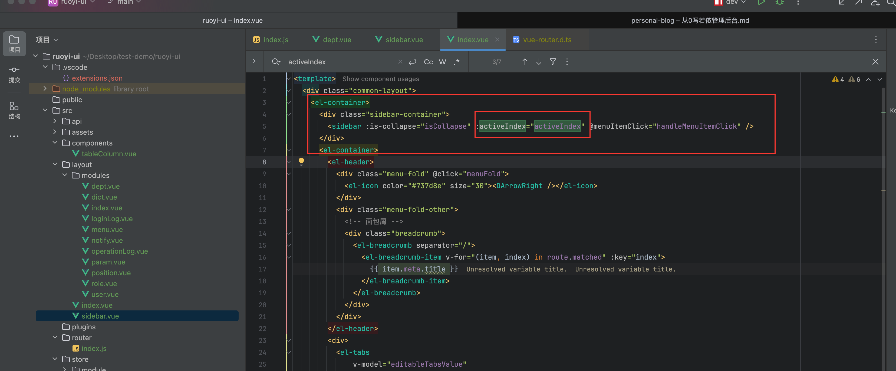

      `sidebar.vue`页面接收一下参数

      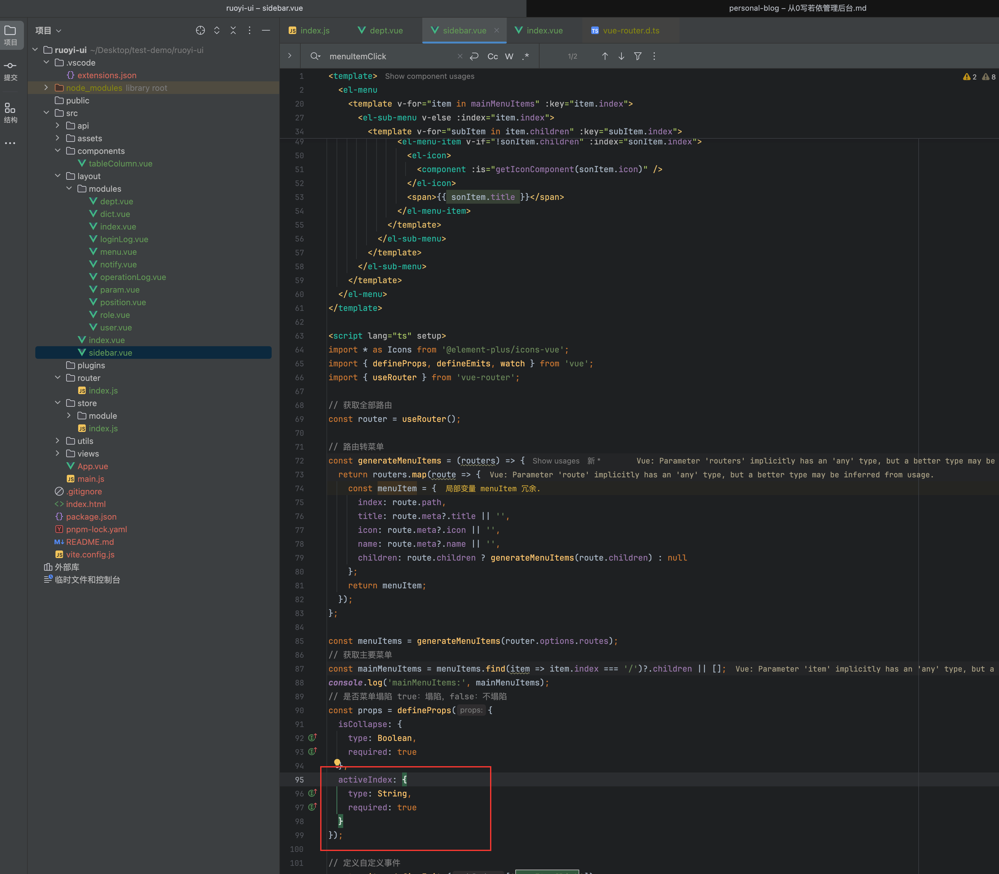

      页面上加上这个参数就可以了

      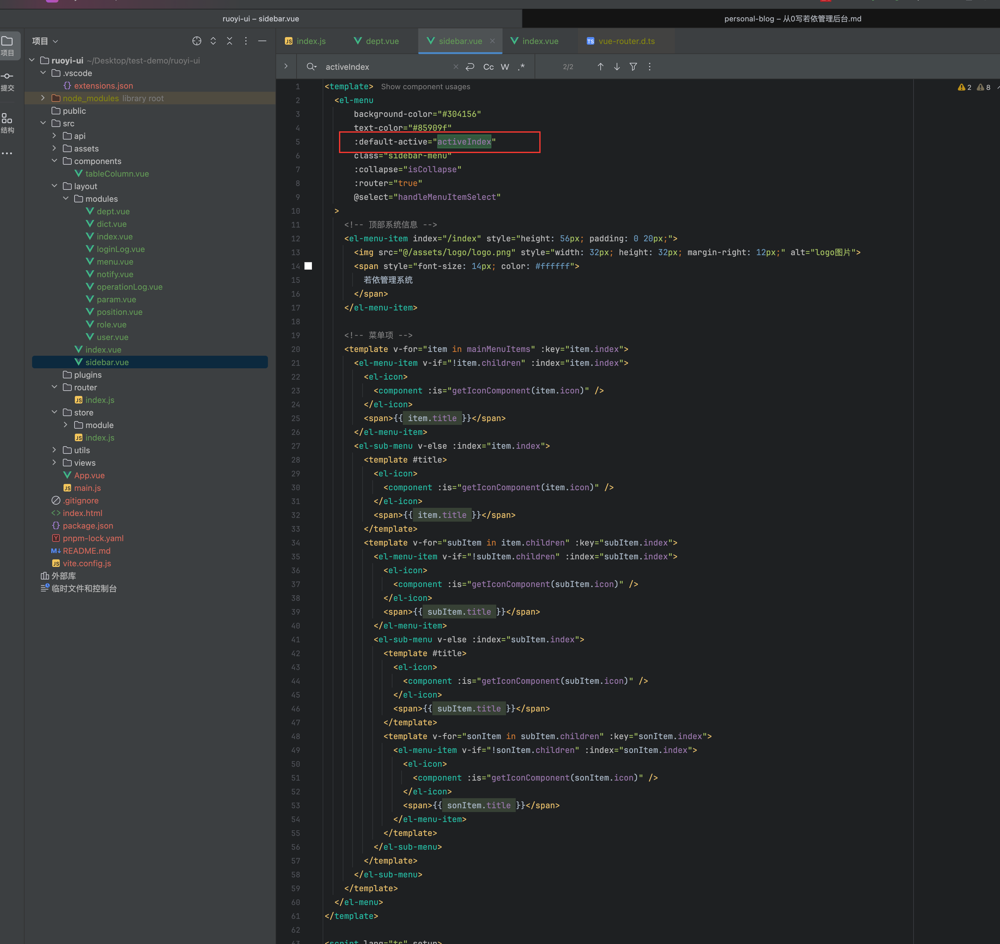

      效果

      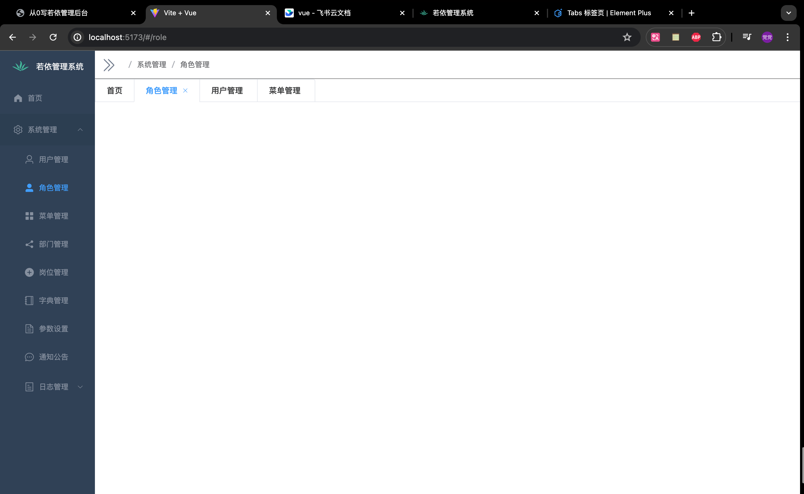
