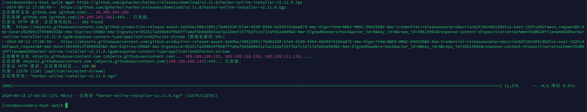
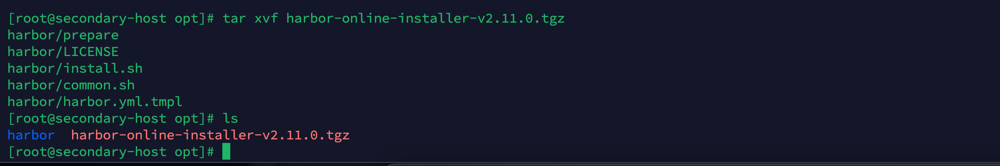
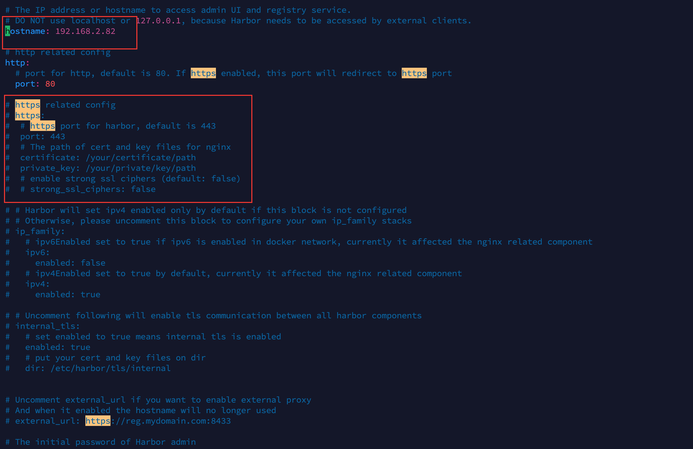
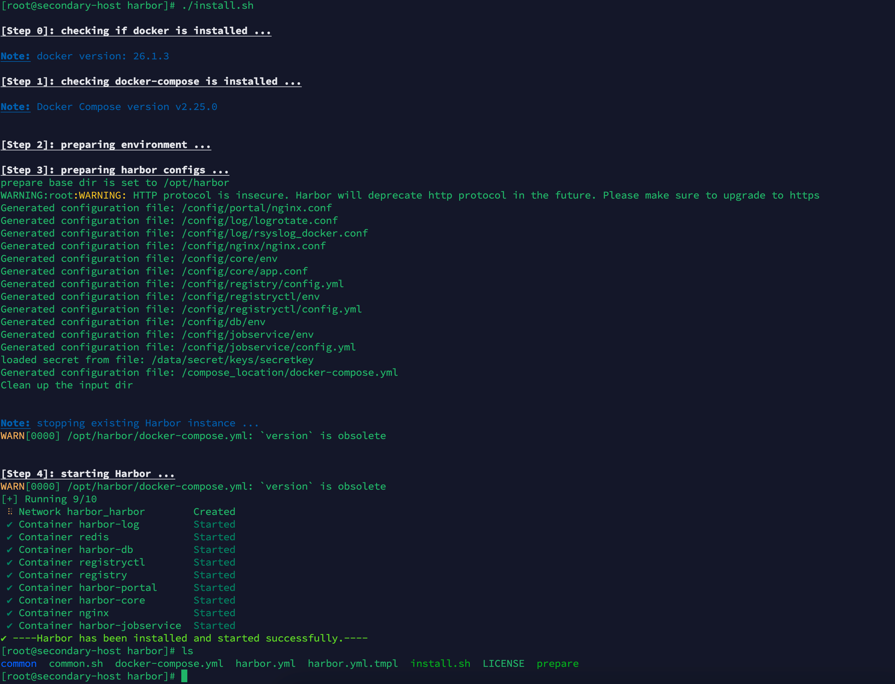
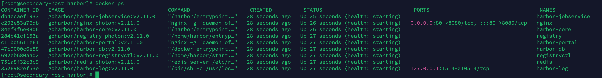
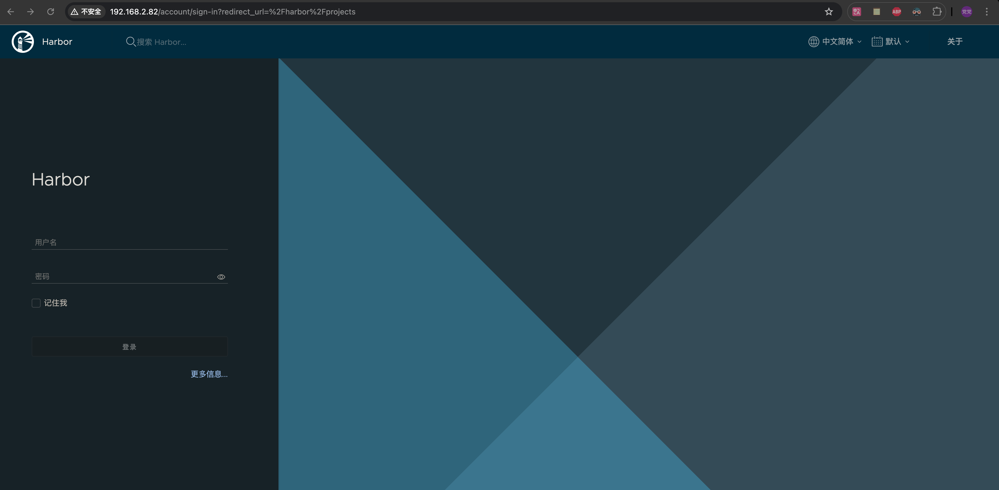
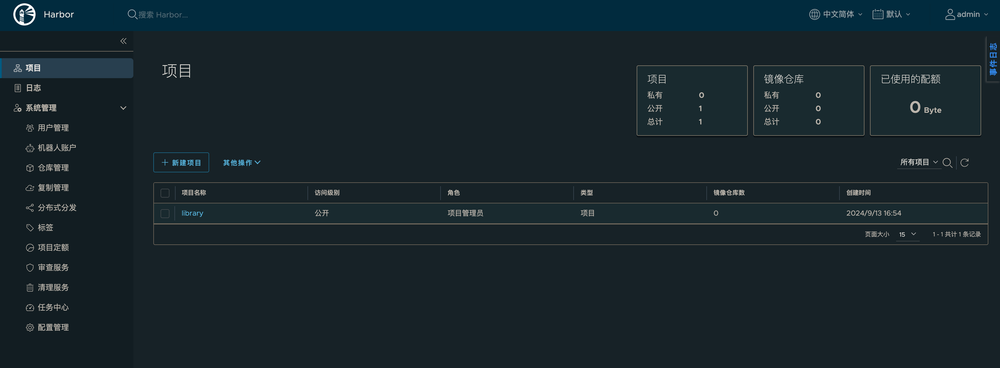

### 前言

> `Harbor`是一个类似于 `Docker-Hub`的容器仓库，属于本地部署的镜像仓库，同样包含`用户管理`、`权限管理`、`镜像管理`。
>
> 本次安装使用的是 `Docker`与`docker-compose`，相对于传统的二进制文件安装相比，不需要关心复杂的服务器环境，只需要在服务器上安装 `Docker`即可；使用 `Docker`的时候我们只关注数据的持久化和`Docker容器`与`宿主机`的端口映射即可，其中数据持久化包括 `conf`、`log`、`镜像`等。

### 基础环境

| 名称             | 版本                           |
| ---------------- | ------------------------------ |
| 服务器及操作系统 | Linux、Centos 7                |
| Docker           | Docker version 26.1.3          |
| Docker Compose   | Docker Compose version v2.27.1 |


### 安装

1. 进入安装目录

   ```bash
   cd /opt
   ```
   
   

2. 下载 Harbor 安装包

   > Harbor是`github`可能会`失败`，也可能会相对来说`比较慢`，多试几次一般都可以拉下来

   ```bash
   # 下载最新的 Harbor 安装包（例如 v2.11.0 版本）
   wget https://github.com/goharbor/harbor/releases/download/v2.11.0/harbor-online-installer-v2.11.0.tgz
   
   # 解压缩
   tar xvf harbor-online-installer-v2.11.0.tgz
   
   # 进入 Harbor 文件夹
   cd harbor
   ```

   

   

   

   3. 修改`harbor.yml`配置文件

      > 这个文件只在安装`harbor`的时候使用一次，后续参数调整在`docker-compose.yml`中调整，并且`docker-compose.yml`会在执行`install.sh`的时候自动创建。

      ```bash
      # 复制 harbor.yml
      cp harbor.yml.tmpl harbor.yml
      
      # 修改 harbor.yml
      vim harbor.yml
      ```

      > 主要看`hostname`、`port`、`harbor_admin_password`、`data_volume`这几个参数
      >
      > **hostname**：改成当前主机 ip 地址或者是域名（重要）
      >
      > **port**：有两个 port，一个是`http`的`80`和`https`的`443`(https注意有个ssl证书，如果`没有证书`建议直接将相关配置注释掉，否则会`报错`)
      >
      > **harbor_admin_password**：后台管理页面的默认密码
      >
      > **data_volume**：数据的存储卷地址

      **补充**

      > 我为了方便演示只修改了`hostname`和注释掉了`https`的相关配置，其他的全部默认

      

   4. 安装

      ```bash
      ./install.sh 
      ```

      

   5. 启动

      ```bash
      docker-compose up -d
      ```

      

      

### 访问

1. 访问地址

   ``` http
   http://ip:端口
   ```

   

2. 登录

   ```tex
   默认账户密码：admin/Harbor12345
   ```

   
