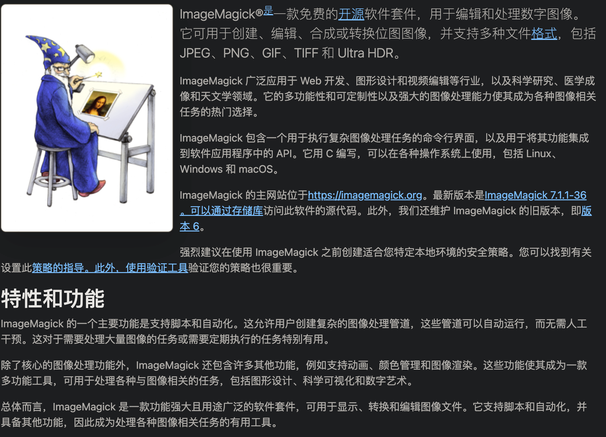

### 简介

#### 官方地址

> [ImageMagick](https://imagemagick.org/index.php)

#### 可以做什么

> 直接 `官网翻译`
> 


### 我的需求

> 我需要做 `图片格式转换`；
> 普通的格式互相转化 `png、jpg、jpeg` 等等直接改后缀不是真正的转换，因为没有发生编码改变，为什么我们可以正常查看呢？是因为是绝大多数软件工具都支持查看这些格式；
> 当我也直接将 `heic转成png`(通过 `改后缀`）在浏览器打开，哦 😯，打不开；哦哦哦，浏览器不支持 `heic` 格式；
> 
> 市面上常见的三种方式：
>
> 1. `直接通过代码流`（java 已验证不可行）
> 2. `ffmpeg` (虽然很强大，但不支持 `heic`)
> 3. `ImageMagick`` (可行)

### 具体操作

##### 安装客户端

> 这里以 Linux（Centos 7）为例，当然也支持 `win` 和 `mac`
> （如果，你使用的是 mac，并且安装了 homebrew，是可以一行命令安装：`brew install imagemagick`）
> 注意 ⚠️：Centos 7 使用 yum 安装默认是 6.x 的版本，如需 7.x 自行官网下载，6.x 与 7.x 的执行参数不同，但是 7.x 兼容 6.x，也就是 6.x 的命令在 7.x 可以运行
>
> ```text
> 6.x 命令：convert、mogrify、identify
> 7.x 命令：magick
> ```

::: steps
1. **更新系统**

    ```bash
    sudo yum update
    ```

2. **安装 EPEL 仓库**

   ```bash
   sudo yum install epel-release
   ```

3. **安装 ImageMagick**
	
    ```bash
    sudo yum install ImageMagick ImageMagick-devel
    ```

4. **验证安装**

   ```bash
   convert -version
   ```

5. 提示
	```text
    安装后，不需要启动，因为是通过代码来触发执行的
    ```
:::

### 相关代码（JAVA）

#### 图片类型转换可选参数类

```java
import lombok.Data;
import lombok.NoArgsConstructor;

/**
 * @Author HiCheer
 * @Date 2024-08-06 21:43
 * @explain 图片类型转换可选参数
 **/
@Data
@NoArgsConstructor
public class ImgConvertOptionalParameter {

    // 设置图像质量（压缩率，ratio的范围：0～100，较低的值会产生更高的压缩率）
    // 示例：convert input.jpg -quality 85 output.jpg
    private String quality_ratio;


    // 设置图像质量（压缩等级，level的范围：0～9，9表示最大压缩等级）
    // 示例：convert input.png -define png:compression-level=9 output.png
    String quality_level;

    // 设置图像质量（颜色数量，color的范围：1～256，256保留颜色最多，最终体积越大）
    // 示例：convert input.png -colors 256 output.png
    String quality_color;

    // 去除所有的元数据
    // 示例：convert input.jpg -quality 75 -strip output.jpg
    String strip;


    /**
     * 压缩可选参数设置
     * @param ratio      压缩率  （ratio的范围：0～100，较低的值会产生更高的压缩率）
     * @param level      压缩等级（level的范围：0～9，9表示最大压缩等级）
     * @param color      颜色数量（color的范围：1～256，256保留颜色最多，最终体积越大）
     * @param strip_flag 去除所有的元数据标识（true：去除，false：不去除）
     */
    public ImgConvertOptionalParameter(Integer ratio, Integer level, Integer color, Boolean strip_flag) {
        quality_ratio = ratio != null ? "-quality " + ratio : null;
        quality_level = level != null ? "-define png:compression-level=" + level : null;
        quality_color = color != null ? "-colors " + color : null;
        strip = strip_flag !=null ? "-strip" : null;
    }
}
```

#### 图片格式转换工具类

```java
import java.io.IOException;

/**
 * @Author HiCheer
 * @Date 2024-08-06 20:48
 * @explain 通过 ImageMagick 图片格式转换
 **/
public class ImageMagickImgConvertUtil {

    private final static String singleCompress = "singleCompress";
    private final static String batchCompress = "batchCompress";

    /**
     * 单个压缩
     * 示例：convert /path/you/input.jpg (-quality 85 | -define png:compression-level=9 | -colors 256) (|-strip) /path/you/output.jpg
     *
     * @param input_img  源文件路径
     * @param output_jpg 目标文件路径
     * @param optionalParameter 配置参数
     */
    public static void singleCompress(String input_img, String output_jpg, ImgConvertOptionalParameter optionalParameter) {
        String command = paramAppend(singleCompress, input_img, output_jpg, null, optionalParameter);
        exec(command);
    }

    /**
     * 批量压缩
     * 示例：mogrify -path /path/you/output_directory (-quality 85 | -define png:compression-level=9 | -colors 256) (|-strip) /path/you/*.jpg
     *
     * @param input_dir    源文件夹路径
     * @param input_format 源文件夹路径下的格式文件（png，jpg，jpeg，gif，heic 等等）
     * @param output_dir   目标文件夹路径下（目标文件格式与源文件名称和格式都一致）
     * @param optionalParameter 配置参数
     */
    public static void batchCompress(String input_dir, String input_format, String output_dir, ImgConvertOptionalParameter optionalParameter) {
        String command = paramAppend(batchCompress, input_dir, output_dir, input_format, optionalParameter);
        exec(command);
    }

    // 执行命令
    private static void exec(String command) {
        try {
            System.err.println("执行的命令：" + command);
            // 使用 ProcessBuilder 执行命令
            ProcessBuilder processBuilder = new ProcessBuilder(command.split(" "));
            processBuilder.redirectErrorStream(true);
            Process process = processBuilder.start();

            // 等待命令执行完成
            int exitCode = process.waitFor();
            if (exitCode == 0) {
                System.err.println("图像压缩成功！");
            } else {
                System.err.println("图像压缩失败，退出码：" + exitCode);
            }
        } catch (IOException | InterruptedException e) {
            throw new RuntimeException(e);
        }
    }


    // 可选参数拼接
    private static String paramAppend(String methodType, String input, String output, String input_format, ImgConvertOptionalParameter optionalParameter) {
        boolean paramValid =  paramValid(methodType, input, output, input_format);
        if (paramValid) throw new RuntimeException("必要参数不可以为空");

        StringBuilder command = new StringBuilder();

        // 单个压缩
        if (methodType.equals("singleCompress")) {
            commonParamAppend(command.append("convert").append(" ").append(input), optionalParameter).append(" ").append(output);
        // 批量压缩
        } else {
            commonParamAppend(command.append("mogrify -path").append(" ").append(output), optionalParameter).append(" ").append(input).append("*.").append(input_format);
        }

        return  command.toString();
    }

    // 相同可选参数拼接
    private static StringBuilder commonParamAppend(StringBuilder command, ImgConvertOptionalParameter optionalParameter) {
        if (optionalParameter.getQuality_ratio() != null) {
            command.append(" ").append(optionalParameter.getQuality_ratio());
        }
        if (optionalParameter.getQuality_level() != null) {
            command.append(" ").append(optionalParameter.getQuality_level());
        }
        if (optionalParameter.getQuality_color() != null) {
            command.append(" ").append(optionalParameter.getQuality_color());
        }
        if (optionalParameter.getStrip() != null) {
            command.append(" ").append(optionalParameter.getStrip());
        }
        return command;
    }

    // 参数校验
    private static boolean paramValid(String methodType, String input, String output, String input_format) {
        if (methodType.equals("singleCompress")) {
            return input == null || output == null;
        } else if (methodType.equals("batchCompress")) {
            return input == null || output == null || input_format == null;
        } else {
            return false;
        }
    }
}
```

#### 测试类

```java
import com.example.just_do_test.utils.ImageMagickImgConvertUtil;
import com.example.just_do_test.utils.ImgConvertOptionalParameter;
import org.junit.jupiter.api.Test;
import org.springframework.boot.test.context.SpringBootTest;

/**
 * @Author HiCheer
 * @Date 2024-08-07 16:02
 * @explain
 **/
@SpringBootTest
public class ImageMagickExample {

    // 单个图片
    @Test
    public void test167 () throws Exception {
        // 源文件
        String input_img = "/Users/hicheer/Desktop/1/4.heic";
        // 目标文件
        String output_jpg = "/Users/hicheer/Desktop/2/2.jpg";

        ImgConvertOptionalParameter optionalParameter = new ImgConvertOptionalParameter(80, 9, 256, true);
        ImageMagickImgConvertUtil.singleCompress(input_img, output_jpg, optionalParameter);
    }

    // 批量图片
    @Test
    public void test168 () throws Exception {
        // 源文件夹
        String input_img = "/Users/hicheer/Desktop/1/";
        // 源文件格式
        String input_format = "jpg";
        // 目标文件夹
        String output_jpg = "/Users/hicheer/Desktop/2/";

        ImgConvertOptionalParameter optionalParameter = new ImgConvertOptionalParameter(80, 9, 256, true);
        ImageMagickImgConvertUtil.batchCompress(input_img, input_format,output_jpg, optionalParameter);
    }

}
```
