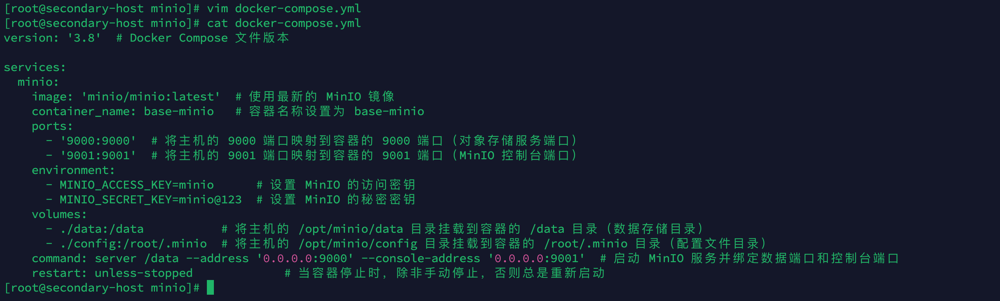
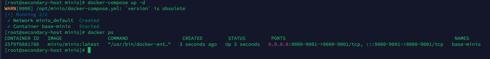
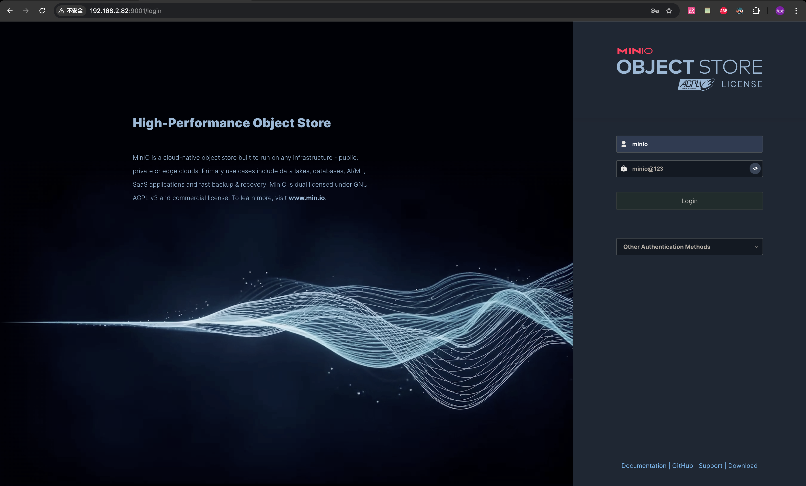
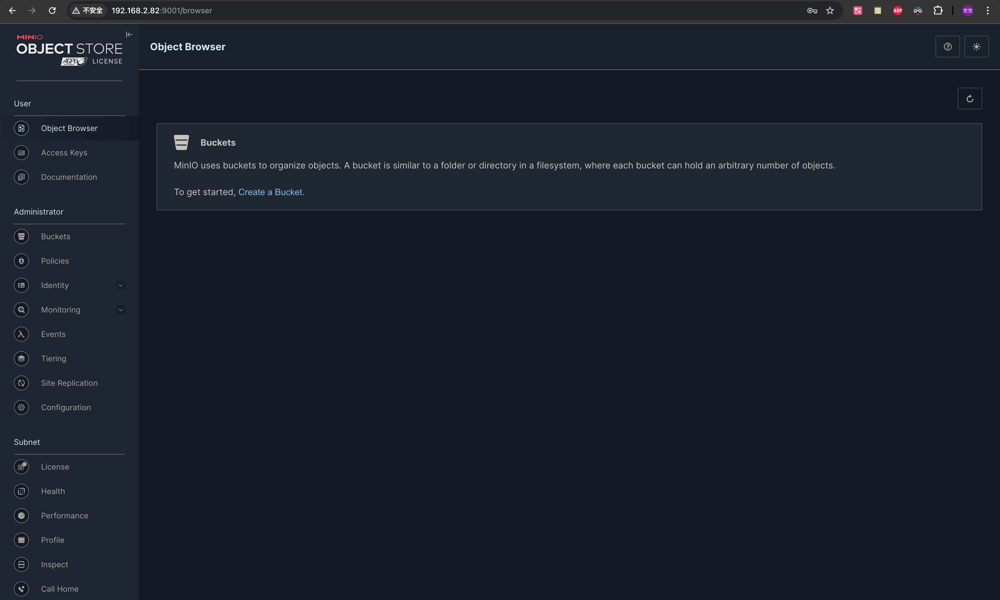

### 前言

> 本次安装使用的是 `Docker`与`docker-compose`，相对于传统的二进制文件安装相比，不需要关心复杂的服务器环境，只需要在服务器上安装 `Docker`即可；使用 `Docker`的时候我们只关注数据的持久化和`Docker容器`与`宿主机`的端口映射即可，其中数据持久化包括 `conf`、`data`等。

### 基础环境

| 名称             | 版本                           |
| ---------------- | ------------------------------ |
| 服务器及操作系统 | Linux、Centos 7                |
| Docker           | Docker version 26.1.3          |
| Docker Compose   | Docker Compose version v2.27.1 |

### 安装

1. 创建 minio 文件夹及进入minio 文件夹

   ```bash
   mkdir /opt/minio && cd /opt/minio
   ```
   
   

2. 创建`docker-compose.yml`

   ```yml
   version: '3.8'  # Docker Compose 文件版本
   
   services:
     minio:
       image: 'minio/minio:latest'  # 使用最新的 MinIO 镜像
       container_name: base-minio   # 容器名称设置为 base-minio
       ports:
         - '9000:9000'  # 将主机的 9000 端口映射到容器的 9000 端口（对象存储服务端口）
         - '9001:9001'  # 将主机的 9001 端口映射到容器的 9001 端口（MinIO 控制台端口）
       environment:
         - MINIO_ACCESS_KEY=minio      # 设置 MinIO 的访问密钥
         - MINIO_SECRET_KEY=minio@123  # 设置 MinIO 的秘密密钥
       volumes:
         - ./data:/data           # 将主机的 /opt/minio/data 目录挂载到容器的 /data 目录（数据存储目录）
         - ./config:/root/.minio  # 将主机的 /opt/minio/config 目录挂载到容器的 /root/.minio 目录（配置文件目录）
       command: server /data --address '0.0.0.0:9000' --console-address '0.0.0.0:9001'  # 启动 MinIO 服务并绑定数据端口和控制台端口
       restart: unless-stopped             # 当容器停止时，除非手动停止，否则总是重新启动
   ```

   

3. 启动

   ```bash
   docker-compose up -d
   ```

   

### 测试

1. 访问地址

   ```http
   http://ip:9001
   ```

   

   


