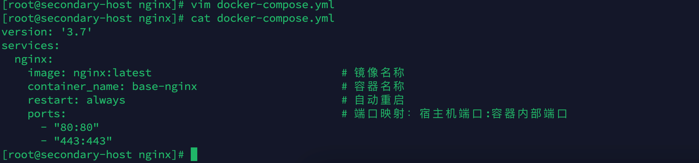
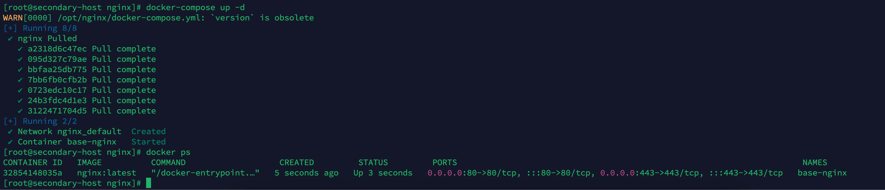
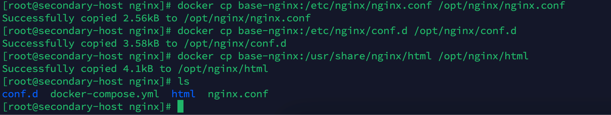
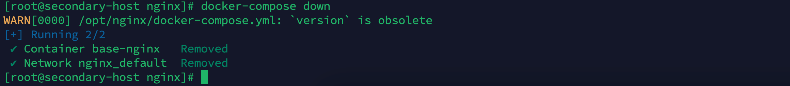
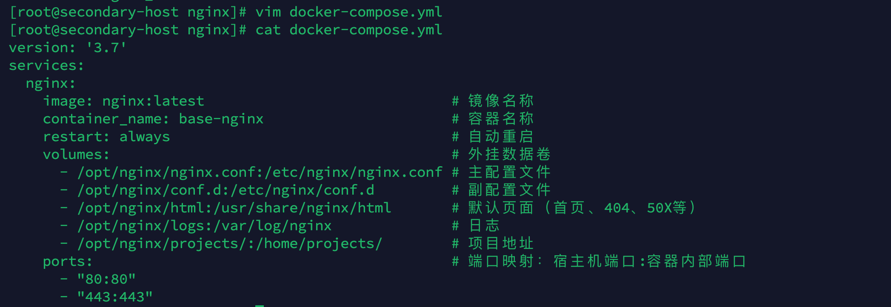
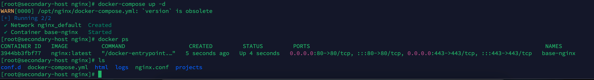
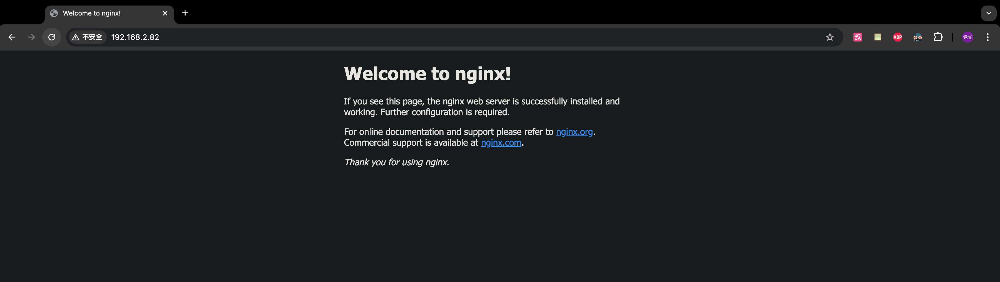

### 前言

> 本次安装使用的是 `Docker`与`docker-compose`，相对于传统的二进制文件安装相比，不需要关心复杂的服务器环境，只需要在服务器上安装 `Docker`即可；使用 `Docker`的时候我们只关注数据的持久化和`Docker容器`与`宿主机`的端口映射即可，其中数据持久化包括 `conf`、`log`、`项目路径地址`等。

### 基础环境

| 名称             | 版本                           |
| ---------------- | ------------------------------ |
| 服务器及操作系统 | Linux、Centos 7                |
| Docker           | Docker version 26.1.3          |
| Docker Compose   | Docker Compose version v2.27.1 |

### 安装

1. 创建 nginx 文件夹及进入nginx 文件夹

   ```bash
   mkdir /opt/nginx && cd /opt/nginx
   ```

   

2. 将容器内的外挂文件复制出来

   编写不含有外挂卷的`docker-compose.yml`

   ```bash
   vim docker-compose.yml
   ```

   ```yml
   version: '3.7'
   services:
     nginx:
       image: nginx:latest                             # 镜像名称    
       container_name: base-nginx                      # 容器名称    
       restart: always                                 # 自动重启    
       ports:                                          # 端口映射：宿主机端口:容器内部端口
         - "80:80"
         - "443:443"
   ```

   

   启动 nginx

   ```bash
   docker-compose up -d
   ```

   

   将容器内外挂卷复制出来

   ```bash
   docker cp base-nginx:/etc/nginx/nginx.conf /opt/nginx/nginx.conf
   docker cp base-nginx:/etc/nginx/conf.d /opt/nginx/conf.d
   docker cp base-nginx:/usr/share/nginx/html /opt/nginx/html
   ```

   

   关闭 nginx

   ```bash
   docker-compose down
   ```

   

3. 启动 Nginx

   修改`docker-compose.yml`

   ```bash
   vim docker-compose.yml
   ```

   ```bash
   version: '3.7'
   services:
     nginx:
       image: nginx:latest                             # 镜像名称    
       container_name: base-nginx                      # 容器名称    
       restart: always                                 # 自动重启    
       volumes:                                        # 外挂数据卷    
         - /opt/nginx/nginx.conf:/etc/nginx/nginx.conf # 主配置文件    
         - /opt/nginx/conf.d:/etc/nginx/conf.d         # 副配置文件       
         - /opt/nginx/html:/usr/share/nginx/html       # 默认页面（首页、404、50X等）      
         - /opt/nginx/logs:/var/log/nginx              # 日志     
         - /opt/nginx/projects/:/home/projects/        # 项目地址    
       ports:                                          # 端口映射：宿主机端口:容器内部端口
         - "80:80"
         - "443:443"
   ```

   

   启动

   ```bash
   docker-compose up -d
   ```

   

### 测试

1. 访问

   ```http
   http://ip:80
   ```

   
