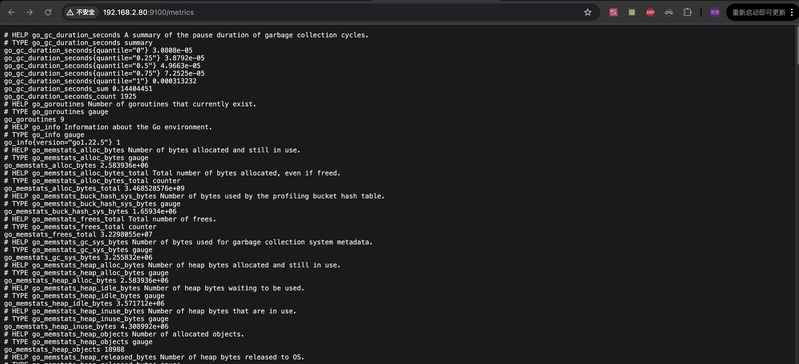
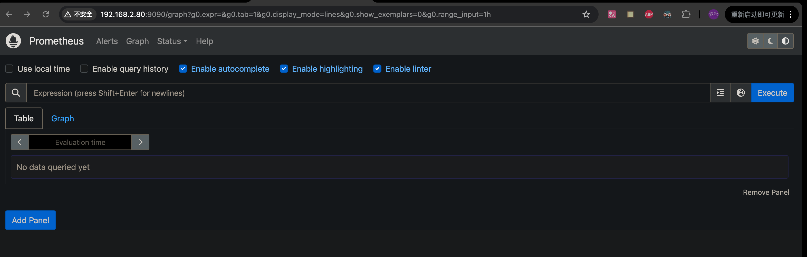
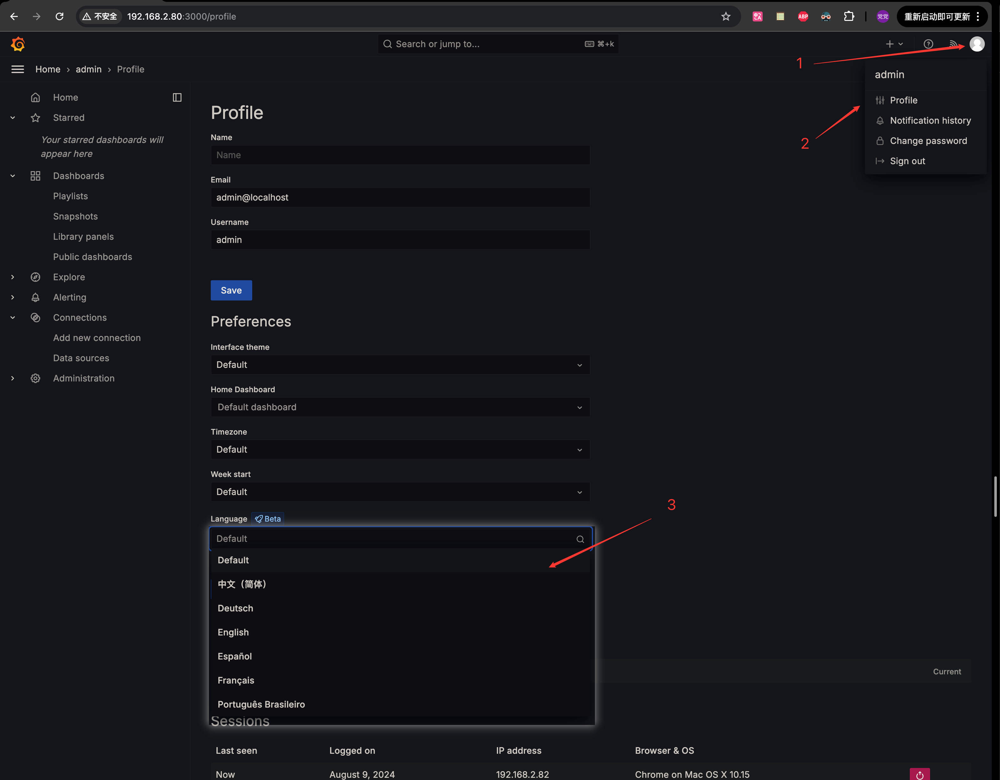
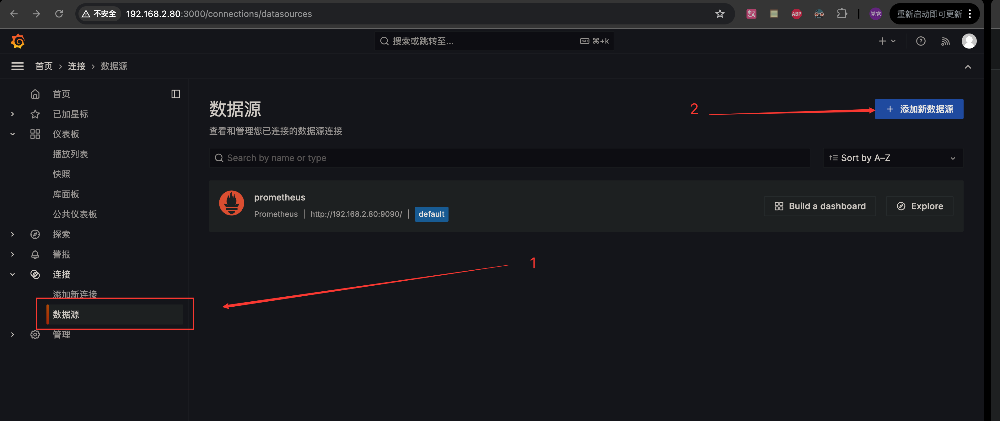
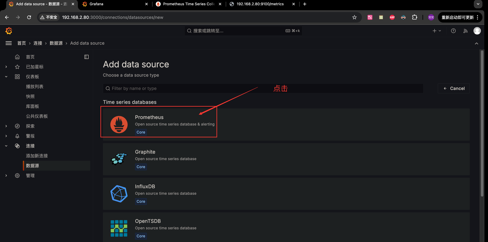
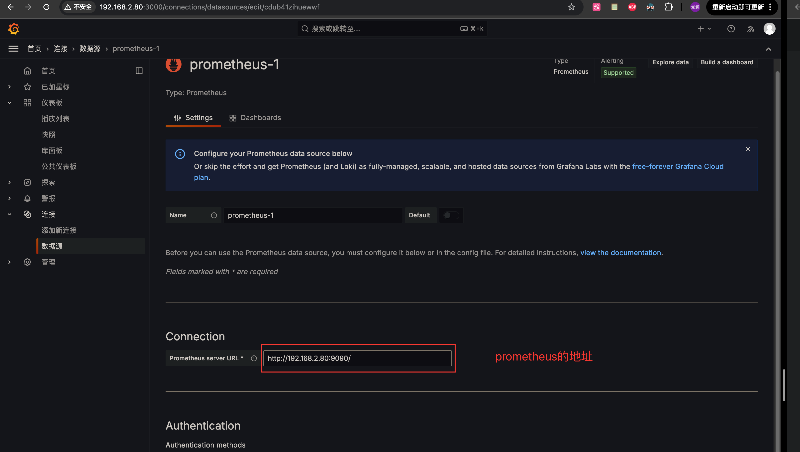
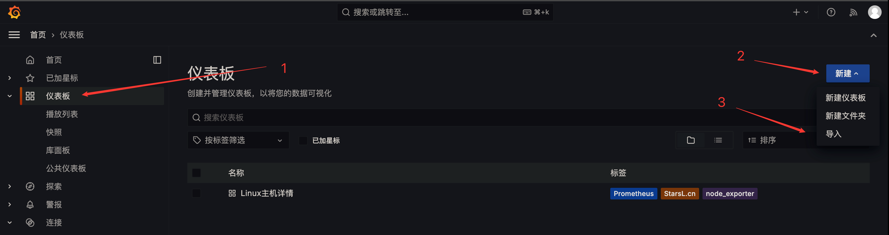
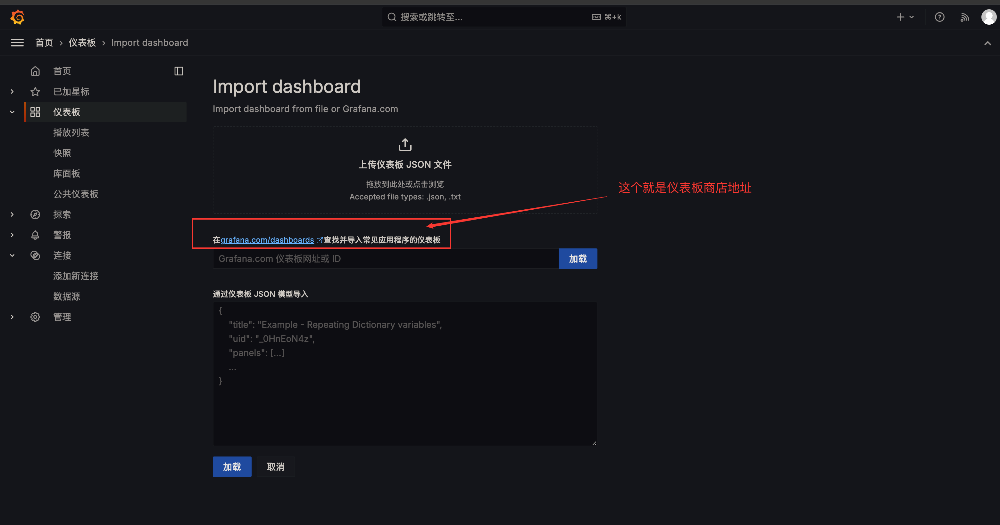
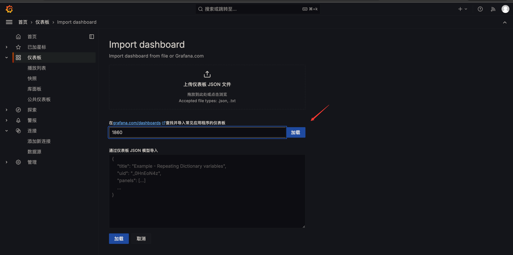
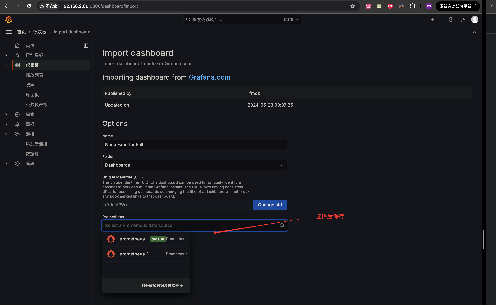

### 安装

> 基于 Docker 容器安装，总共安装了三个镜像（bitnami/prometheus、grafana/grafana、node-exporter）
>

1. 创建挂载目录/文件
   - `prometheus`数据挂载目录
      > 注意⚠️：必须要赋予权限
       ```bash 
      mkdir prometheus_data
      chown -R 1001:1001  prometheus_data
       ```
     
   - 创建`prometheus.yml`配置文件
      ```yaml
      global:
        scrape_interval: 15s
      
      scrape_configs:
        - job_name: 'prometheus'
          static_configs:
            - targets: ['localhost:9090']
        # 下面这个 job 可以先省略，后面安装了 node-exporte，再配置
        - job_name: 'node_exporter'
          static_configs:
            - targets: ['192.168.2.80:9100']
      ```

   - `grafana`数据挂载目录
      > 注意⚠️：必须要赋予权限
        ```bash
        mkdir grafana_data
        chown 472:472 grafana_data
        ```

   -  创建`grafana.ini`配置文件
      > 这个配置文件内容太多了，建议是先启动一个容器，然后从容器中拷贝出来
        ```bash
        docker cp 容器ID:/etc/grafana/grafana.ini ./
        ```

2. 创建启动文件

   - `docker-compose.yml`文件
     ```yaml
     services:
       prometheus:
         image: bitnami/prometheus:latest
         container_name: prometheus
         volumes:
           - ./prometheus_data:/opt/bitnami/prometheus/data
           - ./prometheus.yml:/opt/bitnami/prometheus/conf/prometheus.yml
         ports:
           - "9090:9090"

       grafana:
         image: grafana/grafana:latest
         container_name: grafana
         environment:
           - GF_SERVER_ROOT_URL=http://grafana.server.name
           - GF_SECURITY_ADMIN_PASSWORD=admin
           - GF_SECURITY_ADMIN_USER=admin
         volumes:
           - ./grafana_data:/var/lib/grafana
           - ./grafana.ini:/etc/grafana/grafana.ini
         ports:
           - "3000:3000"
         depends_on:
           - prometheus
     ```
  
3. 启动

   - node_exporter

     >    我这个容器是用来监测我宿主机的指标情况的（cpu、内存、存储等等），默认端口：9100

     ```bash
     docker run -d \
       --name=node_exporter \
       --net="host" \
       prom/node-exporter:latest
     ```

   - prometheus、grafana

     ```bash
     docker-compose up -d ./docker-compose.yml
     ```

4. 访问

   - node_exporter

     ```http
     http://192.168.2.80:9100/metrics
     ```

     

   - prometheus

     ```http
     http://192.168.2.80:9090/graph
     ```

     

   - grafana

     ```http
     http://192.168.2.80:3000/login
     ```

### 配置

1. 中文配置

   

2. 添加数据源

   

   

   

    只添加这一个地址就可以保存了。

3. 仪表板

   > 因为`Grafana`有各种各样的仪表板、例如 ES、mysql等等；
   >
   > 当然`Grafana`他本身是只是提供了制作仪表板功能；也就是可以通过导入别人已经做好、也可以自己动手搞（界面只有英文哦）；
   >
   > 我下面是通过`仪表板商店`导出别人做好的，下面以 linux 指标监控面板为例

   

   

   > 有很多自己选择

   

   
   :::
